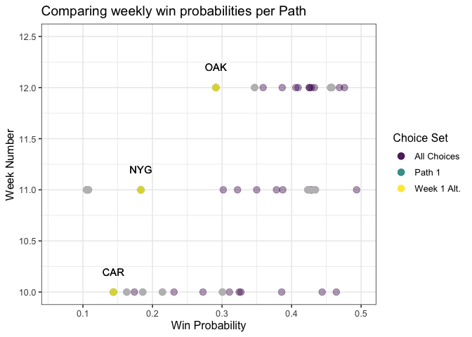
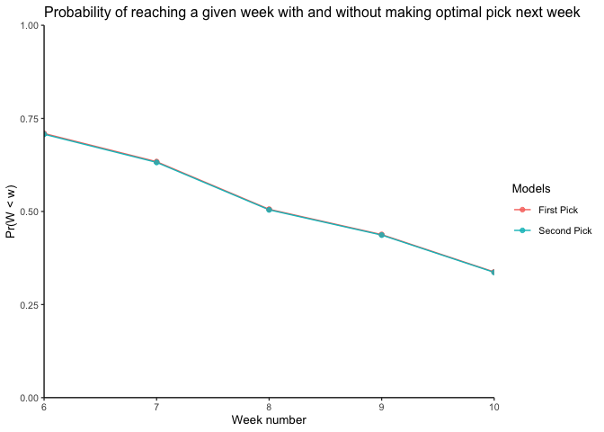
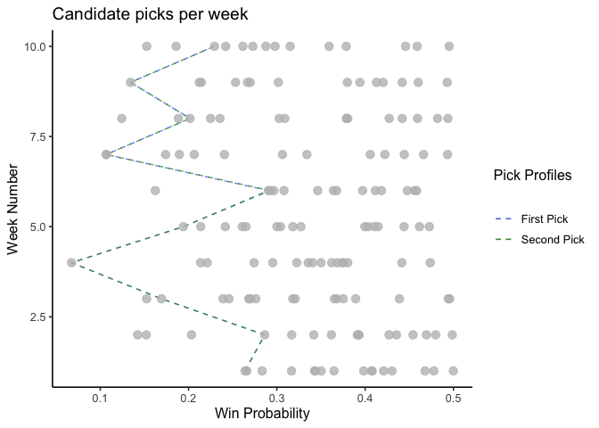

Our annual NFL losers pool runs by each entrant having to pick one team per week. 
The objective is to pick one team to lose each week, if your team wins, you are 
out of the pool. The catch is that once a team is picked it cannot be picked 
again. 

I am taking a fairly simple approach to making my picks this year. 
Download and use the NFL forecast data from 
[FiveThirtyEight](https://projects.fivethirtyeight.com/2021-nfl-predictions/games/) 
to optimize my picks to give the best probability of lasting deep into the season. 


## Visualizations 
Below we can see a heatmap of all the win probabilities throughout the season. 
Teams like Houston, and Washington have a low likelihood of winning in many 
games in the season. This motivates our problem as we can only pick them each 
once. The teams are ordered by average likelihood of winning, we can see Houston, 
Detroit, and Jacksonville are the three lowest teams. There is an opportunity to 
out play my competitors by picking these teams in the best possible week, i.e. 
holding off until Week 4 to pick Houston.

<!-- -->

Below is a plot of the choice set of underdogs in each game. We can see there 
is a finite set of picks per week, with each week having differing probabilities. 
Ideally, we are looking for the path through these points that minimizes our 
chances of losing from the competition.

<!-- -->

## Different approaches to consider

Below I compare two naive strategies with a more rigorous approach. 
We begin in Week 3, as Weeks 1 and 2 are rebuy weeks. These picks are made 
picking the lowest probability remaining after removing weeks 3 - 10.

Approaches:  
1. Pick the lowest team by week, starting in the first week.  
2. Pick the lowest win probability across all weeks.  
3. Pick the team-week pairing with the greatest opportunity cost. In other words, 
if the team isn't picked, how much of a percentage is given up. 

Each of the above approaches allow for future discounting. I.e. 
$$ Pr(Win | Week = w) = Pr(Win) * \beta^{(w - \underline{w})}$$ where 
$\underline{w}$ is the start week. 

The table below shows the optimal picks following each approach, past weeks are 
filled with the set picks I made. We can see there is a slight improvement when 
moving from the naiive approaches to Approach 3.

<table class=" lightable-classic" style='font-family: "Arial Narrow", "Source Sans Pro", sans-serif; width: auto !important; margin-left: auto; margin-right: auto;'>
<caption>Comparison of approaches</caption>
 <thead>
<tr>
<th style="empty-cells: hide;" colspan="1"></th>
<th style="padding-bottom:0; padding-left:3px;padding-right:3px;text-align: center; " colspan="2"><div style="border-bottom: 1px solid #111111; margin-bottom: -1px; ">Approach 1</div></th>
<th style="padding-bottom:0; padding-left:3px;padding-right:3px;text-align: center; " colspan="2"><div style="border-bottom: 1px solid #111111; margin-bottom: -1px; ">Approach 2</div></th>
<th style="padding-bottom:0; padding-left:3px;padding-right:3px;text-align: center; " colspan="2"><div style="border-bottom: 1px solid #111111; margin-bottom: -1px; ">Approach 3</div></th>
</tr>
  <tr>
   <th style="text-align:left;"> Week </th>
   <th style="text-align:left;"> Team </th>
   <th style="text-align:right;"> ProbWin </th>
   <th style="text-align:left;"> Team </th>
   <th style="text-align:right;"> ProbWin </th>
   <th style="text-align:left;"> Team </th>
   <th style="text-align:right;"> ProbWin </th>
  </tr>
 </thead>
<tbody>
  <tr>
   <td style="text-align:left;"> 5 </td>
   <td style="text-align:left;"> MIA </td>
   <td style="text-align:right;"> 0.194 </td>
   <td style="text-align:left;"> MIA </td>
   <td style="text-align:right;"> 0.194 </td>
   <td style="text-align:left;"> MIA </td>
   <td style="text-align:right;"> 0.194 </td>
  </tr>
  <tr>
   <td style="text-align:left;"> 6 </td>
   <td style="text-align:left;"> WSH </td>
   <td style="text-align:right;"> 0.269 </td>
   <td style="text-align:left;"> WSH </td>
   <td style="text-align:right;"> 0.269 </td>
   <td style="text-align:left;"> WSH </td>
   <td style="text-align:right;"> 0.269 </td>
  </tr>
  <tr>
   <td style="text-align:left;"> 7 </td>
   <td style="text-align:left;"> DET </td>
   <td style="text-align:right;"> 0.131 </td>
   <td style="text-align:left;"> DET </td>
   <td style="text-align:right;"> 0.131 </td>
   <td style="text-align:left;"> DET </td>
   <td style="text-align:right;"> 0.131 </td>
  </tr>
  <tr>
   <td style="text-align:left;"> 8 </td>
   <td style="text-align:left;"> JAX </td>
   <td style="text-align:right;"> 0.154 </td>
   <td style="text-align:left;"> JAX </td>
   <td style="text-align:right;"> 0.154 </td>
   <td style="text-align:left;"> NYG </td>
   <td style="text-align:right;"> 0.189 </td>
  </tr>
  <tr>
   <td style="text-align:left;"> 9 </td>
   <td style="text-align:left;"> MIN </td>
   <td style="text-align:right;"> 0.243 </td>
   <td style="text-align:left;"> MIN </td>
   <td style="text-align:right;"> 0.243 </td>
   <td style="text-align:left;"> JAX </td>
   <td style="text-align:right;"> 0.176 </td>
  </tr>
  <tr>
   <td style="text-align:left;"> 10 </td>
   <td style="text-align:left;"> ATL </td>
   <td style="text-align:right;"> 0.218 </td>
   <td style="text-align:left;"> ATL </td>
   <td style="text-align:right;"> 0.218 </td>
   <td style="text-align:left;"> ATL </td>
   <td style="text-align:right;"> 0.218 </td>
  </tr>
  <tr>
   <td style="text-align:left;font-weight: bold;"> Mean </td>
   <td style="text-align:left;font-weight: bold;">  </td>
   <td style="text-align:right;font-weight: bold;"> 0.202 </td>
   <td style="text-align:left;font-weight: bold;">  </td>
   <td style="text-align:right;font-weight: bold;"> 0.202 </td>
   <td style="text-align:left;font-weight: bold;">  </td>
   <td style="text-align:right;font-weight: bold;"> 0.196 </td>
  </tr>
  <tr>
   <td style="text-align:left;font-weight: bold;"> SD </td>
   <td style="text-align:left;font-weight: bold;">  </td>
   <td style="text-align:right;font-weight: bold;"> 0.052 </td>
   <td style="text-align:left;font-weight: bold;">  </td>
   <td style="text-align:right;font-weight: bold;"> 0.052 </td>
   <td style="text-align:left;font-weight: bold;">  </td>
   <td style="text-align:right;font-weight: bold;"> 0.046 </td>
  </tr>
</tbody>
</table>
## Discounting future games

We have been working off a $\beta = 1$ for each model. Below are the changes 
from using different values of $\beta$. Future discounting will place a higher 
weight on upcoming weeks. This will not change the By Week model but will 
have an impact on the By Probability and By Oppertunity Cost. The overall average 
probability of winning a game will increase as we are discounting future games. 
What matters now though is how much more probability we are shifting away from 
future weeks and to upcoming weeks. Therefore, we should no longer evaluate 
from the average risk per week, and instead the likelihood of reaching a given week. 

## Calculating probability of making a given week

Since the game outcomes are binary 
we can also calculate the proportion of times we reach a given week 
as the following, recall $Pr(w_i)$ is the probability of the pick winning 
in week $i$, or losing in week $i$.

$$ Pr(W \leq w) = \Pi_{i = 1}^w (1 - Pr(w_i))  $$

<!-- --><table class=" lightable-classic" style='font-family: "Arial Narrow", "Source Sans Pro", sans-serif; width: auto !important; margin-left: auto; margin-right: auto;border-bottom: 0;'>
<caption>Likelihood of reaching a given week by model</caption>
 <thead>
  <tr>
   <th style="text-align:right;"> Week </th>
   <th style="text-align:right;"> Opp Cost, Beta = 1 </th>
   <th style="text-align:right;"> Opp Cost, Beta = 0.9 </th>
   <th style="text-align:right;"> Opp Cost, Beta = 0.7 </th>
   <th style="text-align:right;"> By Prob, Beta = 1 </th>
   <th style="text-align:right;"> By Prob, Beta = 0.9 </th>
   <th style="text-align:right;"> By Prob, Beta = 0,7 </th>
   <th style="text-align:right;"> By Week </th>
  </tr>
 </thead>
<tbody>
  <tr>
   <td style="text-align:right;"> 5 </td>
   <td style="text-align:right;"> 0.81 </td>
   <td style="text-align:right;"> 0.81 </td>
   <td style="text-align:right;"> 0.81 </td>
   <td style="text-align:right;"> 0.81 </td>
   <td style="text-align:right;"> 0.81 </td>
   <td style="text-align:right;"> 0.74 </td>
   <td style="text-align:right;"> 0.81 </td>
  </tr>
  <tr>
   <td style="text-align:right;"> 6 </td>
   <td style="text-align:right;"> 0.59 </td>
   <td style="text-align:right;"> 0.59 </td>
   <td style="text-align:right;"> 0.59 </td>
   <td style="text-align:right;"> 0.59 </td>
   <td style="text-align:right;"> 0.59 </td>
   <td style="text-align:right;"> 0.54 </td>
   <td style="text-align:right;"> 0.59 </td>
  </tr>
  <tr>
   <td style="text-align:right;"> 7 </td>
   <td style="text-align:right;"> 0.51 </td>
   <td style="text-align:right;"> 0.51 </td>
   <td style="text-align:right;"> 0.51 </td>
   <td style="text-align:right;"> 0.51 </td>
   <td style="text-align:right;"> 0.51 </td>
   <td style="text-align:right;"> 0.47 </td>
   <td style="text-align:right;"> 0.51 </td>
  </tr>
  <tr>
   <td style="text-align:right;"> 8 </td>
   <td style="text-align:right;"> 0.42 </td>
   <td style="text-align:right;"> 0.42 </td>
   <td style="text-align:right;"> 0.42 </td>
   <td style="text-align:right;"> 0.43 </td>
   <td style="text-align:right;"> 0.43 </td>
   <td style="text-align:right;"> 0.39 </td>
   <td style="text-align:right;"> 0.43 </td>
  </tr>
  <tr>
   <td style="text-align:right;"> 9 </td>
   <td style="text-align:right;"> 0.34 </td>
   <td style="text-align:right;"> 0.34 </td>
   <td style="text-align:right;"> 0.34 </td>
   <td style="text-align:right;"> 0.33 </td>
   <td style="text-align:right;"> 0.33 </td>
   <td style="text-align:right;"> 0.30 </td>
   <td style="text-align:right;"> 0.33 </td>
  </tr>
  <tr>
   <td style="text-align:right;"> 10 </td>
   <td style="text-align:right;"> 0.27 </td>
   <td style="text-align:right;"> 0.27 </td>
   <td style="text-align:right;"> 0.27 </td>
   <td style="text-align:right;"> 0.26 </td>
   <td style="text-align:right;"> 0.26 </td>
   <td style="text-align:right;"> 0.24 </td>
   <td style="text-align:right;"> 0.26 </td>
  </tr>
</tbody>
<tfoot>
<tr><td style="padding: 0; " colspan="100%"><span style="font-style: italic;">Note: </span></td></tr>
<tr><td style="padding: 0; " colspan="100%">
<sup></sup> Percentages represent the likelihood of reaching a given <br>           week based on the picks from each model.</td></tr>
</tfoot>
</table>

As expected, we have better chances earlier when using a discount value less than 
one for the Opportunity Cost model. Notice there is not much variation across 
differing beta values. 


```
## Warning in merge.data.table(..., by = c("week"), all.x = TRUE): column names
## 'loser.x', 'p_win.x', 'loser.y', 'p_win.y' are duplicated in the result
```

<table class=" lightable-classic" style='font-family: "Arial Narrow", "Source Sans Pro", sans-serif; width: auto !important; margin-left: auto; margin-right: auto;'>
<caption>Weekly Picks by Model</caption>
 <thead>
<tr>
<th style="empty-cells: hide;" colspan="1"></th>
<th style="padding-bottom:0; padding-left:3px;padding-right:3px;text-align: center; " colspan="2"><div style="border-bottom: 1px solid #111111; margin-bottom: -1px; ">OC, Beta = 1</div></th>
<th style="padding-bottom:0; padding-left:3px;padding-right:3px;text-align: center; " colspan="2"><div style="border-bottom: 1px solid #111111; margin-bottom: -1px; ">OC, Beta = 0.9</div></th>
<th style="padding-bottom:0; padding-left:3px;padding-right:3px;text-align: center; " colspan="2"><div style="border-bottom: 1px solid #111111; margin-bottom: -1px; ">OC, Beta = 0.7</div></th>
<th style="padding-bottom:0; padding-left:3px;padding-right:3px;text-align: center; " colspan="2"><div style="border-bottom: 1px solid #111111; margin-bottom: -1px; ">By Week</div></th>
</tr>
  <tr>
   <th style="text-align:left;"> Week </th>
   <th style="text-align:left;"> Team </th>
   <th style="text-align:right;"> ProbWin </th>
   <th style="text-align:left;"> Team </th>
   <th style="text-align:right;"> ProbWin </th>
   <th style="text-align:left;"> Team </th>
   <th style="text-align:right;"> ProbWin </th>
   <th style="text-align:left;"> Team </th>
   <th style="text-align:right;"> ProbWin </th>
  </tr>
 </thead>
<tbody>
  <tr>
   <td style="text-align:left;"> 5 </td>
   <td style="text-align:left;"> MIA </td>
   <td style="text-align:right;"> 0.194 </td>
   <td style="text-align:left;"> MIA </td>
   <td style="text-align:right;"> 0.194 </td>
   <td style="text-align:left;"> MIA </td>
   <td style="text-align:right;"> 0.194 </td>
   <td style="text-align:left;"> MIA </td>
   <td style="text-align:right;"> 0.194 </td>
  </tr>
  <tr>
   <td style="text-align:left;"> 6 </td>
   <td style="text-align:left;"> WSH </td>
   <td style="text-align:right;"> 0.269 </td>
   <td style="text-align:left;"> WSH </td>
   <td style="text-align:right;"> 0.269 </td>
   <td style="text-align:left;"> WSH </td>
   <td style="text-align:right;"> 0.269 </td>
   <td style="text-align:left;"> WSH </td>
   <td style="text-align:right;"> 0.269 </td>
  </tr>
  <tr>
   <td style="text-align:left;"> 7 </td>
   <td style="text-align:left;"> DET </td>
   <td style="text-align:right;"> 0.131 </td>
   <td style="text-align:left;"> DET </td>
   <td style="text-align:right;"> 0.131 </td>
   <td style="text-align:left;"> DET </td>
   <td style="text-align:right;"> 0.131 </td>
   <td style="text-align:left;"> DET </td>
   <td style="text-align:right;"> 0.131 </td>
  </tr>
  <tr>
   <td style="text-align:left;"> 8 </td>
   <td style="text-align:left;"> NYG </td>
   <td style="text-align:right;"> 0.189 </td>
   <td style="text-align:left;"> NYG </td>
   <td style="text-align:right;"> 0.189 </td>
   <td style="text-align:left;"> NYG </td>
   <td style="text-align:right;"> 0.189 </td>
   <td style="text-align:left;"> JAX </td>
   <td style="text-align:right;"> 0.154 </td>
  </tr>
  <tr>
   <td style="text-align:left;"> 9 </td>
   <td style="text-align:left;"> JAX </td>
   <td style="text-align:right;"> 0.176 </td>
   <td style="text-align:left;"> JAX </td>
   <td style="text-align:right;"> 0.176 </td>
   <td style="text-align:left;"> JAX </td>
   <td style="text-align:right;"> 0.176 </td>
   <td style="text-align:left;"> MIN </td>
   <td style="text-align:right;"> 0.243 </td>
  </tr>
  <tr>
   <td style="text-align:left;"> 10 </td>
   <td style="text-align:left;"> ATL </td>
   <td style="text-align:right;"> 0.218 </td>
   <td style="text-align:left;"> ATL </td>
   <td style="text-align:right;"> 0.218 </td>
   <td style="text-align:left;"> ATL </td>
   <td style="text-align:right;"> 0.218 </td>
   <td style="text-align:left;"> ATL </td>
   <td style="text-align:right;"> 0.218 </td>
  </tr>
  <tr>
   <td style="text-align:left;font-weight: bold;"> Mean </td>
   <td style="text-align:left;font-weight: bold;">  </td>
   <td style="text-align:right;font-weight: bold;"> 0.196 </td>
   <td style="text-align:left;font-weight: bold;">  </td>
   <td style="text-align:right;font-weight: bold;"> 0.196 </td>
   <td style="text-align:left;font-weight: bold;">  </td>
   <td style="text-align:right;font-weight: bold;"> 0.196 </td>
   <td style="text-align:left;font-weight: bold;">  </td>
   <td style="text-align:right;font-weight: bold;"> 0.202 </td>
  </tr>
  <tr>
   <td style="text-align:left;font-weight: bold;"> SD </td>
   <td style="text-align:left;font-weight: bold;">  </td>
   <td style="text-align:right;font-weight: bold;"> 0.046 </td>
   <td style="text-align:left;font-weight: bold;">  </td>
   <td style="text-align:right;font-weight: bold;"> 0.046 </td>
   <td style="text-align:left;font-weight: bold;">  </td>
   <td style="text-align:right;font-weight: bold;"> 0.046 </td>
   <td style="text-align:left;font-weight: bold;">  </td>
   <td style="text-align:right;font-weight: bold;"> 0.052 </td>
  </tr>
</tbody>
</table>

We see now a $\beta = 0.7$ gets us back to our best pick per week approach, and 
it is the $\beta = 0.9$ that may be the better option. Where we trade off total 
average for a better liklihood of lasting in the event. 

## Dumbbell plot 

Our best two models are the $OC, Beta = 1$ and $OC, Beta = 0.9$. Below are the 
differences in the picks. 

<!-- -->

## Alterative weeks for optimal team picks
We can view other weeks of the recommended team below in a selection plot. 
Here the only alternative to picking HOU comes in the By Prob, Beta = 0.7 model 
which selects PIT. However, it is clear there is no future gain from this pick.

<!-- -->

## What is the next best possible pick?
If we remove the optimal pick from our choice set, what is the next best pick?
This is done so I can consider picking two different teams per week to hedge my 
bets. 

<!-- --><!-- --><table class=" lightable-classic" style='font-family: "Arial Narrow", "Source Sans Pro", sans-serif; width: auto !important; margin-left: auto; margin-right: auto;'>
<caption>Recommended sets of picks</caption>
 <thead>
<tr>
<th style="empty-cells: hide;" colspan="1"></th>
<th style="padding-bottom:0; padding-left:3px;padding-right:3px;text-align: center; " colspan="2"><div style="border-bottom: 1px solid #111111; margin-bottom: -1px; ">Optimal Pick</div></th>
<th style="padding-bottom:0; padding-left:3px;padding-right:3px;text-align: center; " colspan="2"><div style="border-bottom: 1px solid #111111; margin-bottom: -1px; ">Next Best</div></th>
</tr>
  <tr>
   <th style="text-align:left;"> Week </th>
   <th style="text-align:left;"> Pick </th>
   <th style="text-align:right;"> ProbWin </th>
   <th style="text-align:left;"> Pick </th>
   <th style="text-align:right;"> ProbWin </th>
  </tr>
 </thead>
<tbody>
  <tr>
   <td style="text-align:left;"> 5 </td>
   <td style="text-align:left;"> MIA </td>
   <td style="text-align:right;"> 0.194 </td>
   <td style="text-align:left;"> NYG </td>
   <td style="text-align:right;"> 0.261 </td>
  </tr>
  <tr>
   <td style="text-align:left;"> 6 </td>
   <td style="text-align:left;"> WSH </td>
   <td style="text-align:right;"> 0.269 </td>
   <td style="text-align:left;"> WSH </td>
   <td style="text-align:right;"> 0.269 </td>
  </tr>
  <tr>
   <td style="text-align:left;"> 7 </td>
   <td style="text-align:left;"> DET </td>
   <td style="text-align:right;"> 0.131 </td>
   <td style="text-align:left;"> DET </td>
   <td style="text-align:right;"> 0.131 </td>
  </tr>
  <tr>
   <td style="text-align:left;"> 8 </td>
   <td style="text-align:left;"> NYG </td>
   <td style="text-align:right;"> 0.189 </td>
   <td style="text-align:left;"> MIA </td>
   <td style="text-align:right;"> 0.163 </td>
  </tr>
  <tr>
   <td style="text-align:left;"> 9 </td>
   <td style="text-align:left;"> JAX </td>
   <td style="text-align:right;"> 0.176 </td>
   <td style="text-align:left;"> JAX </td>
   <td style="text-align:right;"> 0.176 </td>
  </tr>
  <tr>
   <td style="text-align:left;"> 10 </td>
   <td style="text-align:left;"> ATL </td>
   <td style="text-align:right;"> 0.218 </td>
   <td style="text-align:left;"> ATL </td>
   <td style="text-align:right;"> 0.218 </td>
  </tr>
  <tr>
   <td style="text-align:left;font-weight: bold;"> Mean </td>
   <td style="text-align:left;font-weight: bold;">  </td>
   <td style="text-align:right;font-weight: bold;"> 0.196 </td>
   <td style="text-align:left;font-weight: bold;">  </td>
   <td style="text-align:right;font-weight: bold;"> 0.203 </td>
  </tr>
  <tr>
   <td style="text-align:left;font-weight: bold;"> SD </td>
   <td style="text-align:left;font-weight: bold;">  </td>
   <td style="text-align:right;font-weight: bold;"> 0.046 </td>
   <td style="text-align:left;font-weight: bold;">  </td>
   <td style="text-align:right;font-weight: bold;"> 0.055 </td>
  </tr>
</tbody>
</table>


### Showing pick profiles on choice set
<!-- -->
The above analysis is not very supportive of not taking MIA in both picks next week. 
This analysis is flawed, as we rule out the first pick in each week. 

## Todos
* Make the choice plot with paths of optimal picks include picks from first N weeks.

