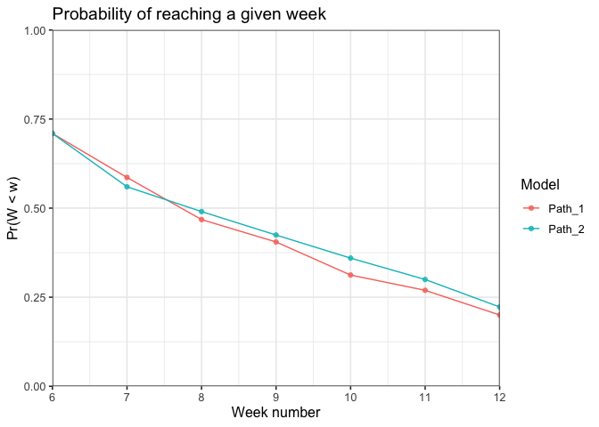

Our annual NFL losers pool runs by each enterant having to pick one team per week. 
The objective is to pick one team to lose each week, if your team wins, you are 
out of the pool. The catch is that once a team is picked it cannot be picked 
again. 

My approach is simple, use the NFL forecast data from [FiveThirtyEight](https://projects.fivethirtyeight.com/2021-nfl-predictions/games/) 
and optimize my picks to minimize the total win probability across the season. 


```r
#TODO: Update the code to handle future weeks.

source("pick_functions.R")
pacman::p_load(data.table, ggplot2, ggalt, dplyr, knitr, kableExtra)

# Setup ---- 
path <- "https://projects.fivethirtyeight.com/nfl-api/nfl_elo_latest.csv"
week1 <- as.Date("2021-09-09")
total_weeks <- 10
start_week <- max(ceiling(as.numeric(( Sys.Date() - as.Date("2021-09-09") )) / 7) + 1, 3) # little janky
time_period <- c(start_week:total_weeks)
past_picks <- c("CHI", "TEN", "NYJ")
past_weeks <- c(1, 2, 3)

dt <- read_data(path)
```

Below we can see a heatmap of all the win probabilities throughout the season. 
Teams like Houston, and Washington have a low lieklihood of winning in many 
games in the season. This motivates our problem as we can only pick them each 
once. 


```r
# sort teams by average win prob
dt %>% 
  tidyr::pivot_longer(cols = c("loser", "winner"), values_to = "team") %>%
  mutate(p = ifelse(name == "loser", p_win, p_win_winner)) %>%
  select(-c("p_win", "p_win_winner")) %>%
  group_by(team) %>%
  mutate(win_avg = mean(p)) %>%
  ungroup() %>%
  mutate(team = reorder(team, win_avg)) %>% # reorder teams by avg win
  ggplot(aes(week, team, fill=p)) + 
  geom_tile() + 
  scale_fill_viridis_c("Pr(Win)") + 
  theme_classic() + 
  labs(title = "Weekly Win Probabilities Heatmap by team", 
       x = "Week Number", 
       y = "Team Name") + 
  scale_x_continuous(expand = c(0, 0))
```

<!-- -->

We can also limit our choices to the forecasted underdog, as there are more teams 
than weeks we should never need to pick a favourite. 

```r
ggplot() + 
  geom_point(data = dt, aes(x=week, y=p_win), alpha=0.8, color="gray", size = 3) + 
  coord_flip() + 
  labs(title = "Candidate picks per week", 
       x = "Week Number", 
       y = "Win Probability") + 
  theme_classic(12)
```

<!-- -->

## Different approaches to consider

Below I compare two naive strategies with a more rigorous approach. 
We begin in Week 3, as Weeks 1 and 2 are rebuy weeks. These picks are made 
picking the lowest probability remaining after removing weeks 3 - 10.

Approaches:  
1. Pick the lowest team by week, starting in the first week.  
2. Pick the lowest win probability across all weeks.  
3. Pick the team-week pairing with the greatest opportunity cost. In other words, 
if the team isn't picked, how much of a percentage is given up. 

Each of the above approaches allow for future discounting. I.e. 
$$ Pr(Win | Week = w) = Pr(Win) * \beta^{(w - \underline{w})}$$ where 
$\underline{w}$ is the start week. 


```r
wk <- by_week(past_picks, past_weeks, beta = 1, start_week = start_week, total_weeks = total_weeks)
pr <- by_prob(past_picks, past_weeks, beta = 1, start_week = start_week, total_weeks = total_weeks)
oc <- by_oc(past_picks, past_weeks, beta = 1, start_week = start_week, total_weeks = total_weeks)

tbl <- left_join(wk, pr, by="week")
tbl <- left_join(tbl, oc, by="week")
names <- c("Week", rep(c("Team", "ProbWin"), 3))
names(tbl) <- names

avg_1 <- mean(as.numeric(wk$p_win))
avg_2 <- mean(as.numeric(pr$p_win))
avg_3 <- mean(as.numeric(oc$p_win))
avg_row <- data.frame("Mean", "", avg_1, "", avg_2, "", avg_3)
names(avg_row) <- names(tbl)


sd_1 <- sd(as.numeric(wk$p_win))
sd_2 <- sd(as.numeric(pr$p_win))
sd_3 <- sd(as.numeric(oc$p_win))
sd_row <- data.frame("SD", "", sd_1, "", sd_2, "", sd_3)
names(sd_row) <- names(tbl)


tbl <- rbind(tbl, avg_row)
tbl <- rbind(tbl, sd_row)

kbl(tbl, digits=3) %>%
  kable_classic(full_width=F) %>%
  add_header_above(c(" " = 1, "Approach 1" = 2, "Approach 2" = 2, "Approach 3" = 2)) %>%
  row_spec(nrow(tbl), bold=T) %>%
  row_spec(nrow(tbl) - 1, bold=T)
```

<table class=" lightable-classic" style='font-family: "Arial Narrow", "Source Sans Pro", sans-serif; width: auto !important; margin-left: auto; margin-right: auto;'>
 <thead>
<tr>
<th style="empty-cells: hide;" colspan="1"></th>
<th style="padding-bottom:0; padding-left:3px;padding-right:3px;text-align: center; " colspan="2"><div style="border-bottom: 1px solid #111111; margin-bottom: -1px; ">Approach 1</div></th>
<th style="padding-bottom:0; padding-left:3px;padding-right:3px;text-align: center; " colspan="2"><div style="border-bottom: 1px solid #111111; margin-bottom: -1px; ">Approach 2</div></th>
<th style="padding-bottom:0; padding-left:3px;padding-right:3px;text-align: center; " colspan="2"><div style="border-bottom: 1px solid #111111; margin-bottom: -1px; ">Approach 3</div></th>
</tr>
  <tr>
   <th style="text-align:left;"> Week </th>
   <th style="text-align:left;"> Team </th>
   <th style="text-align:right;"> ProbWin </th>
   <th style="text-align:left;"> Team </th>
   <th style="text-align:right;"> ProbWin </th>
   <th style="text-align:left;"> Team </th>
   <th style="text-align:right;"> ProbWin </th>
  </tr>
 </thead>
<tbody>
  <tr>
   <td style="text-align:left;"> 4 </td>
   <td style="text-align:left;"> HOU </td>
   <td style="text-align:right;"> 0.068 </td>
   <td style="text-align:left;"> HOU </td>
   <td style="text-align:right;"> 0.068 </td>
   <td style="text-align:left;"> HOU </td>
   <td style="text-align:right;"> 0.068 </td>
  </tr>
  <tr>
   <td style="text-align:left;"> 5 </td>
   <td style="text-align:left;"> DET </td>
   <td style="text-align:right;"> 0.196 </td>
   <td style="text-align:left;"> MIA </td>
   <td style="text-align:right;"> 0.224 </td>
   <td style="text-align:left;"> MIA </td>
   <td style="text-align:right;"> 0.224 </td>
  </tr>
  <tr>
   <td style="text-align:left;"> 6 </td>
   <td style="text-align:left;"> WSH </td>
   <td style="text-align:right;"> 0.250 </td>
   <td style="text-align:left;"> WSH </td>
   <td style="text-align:right;"> 0.250 </td>
   <td style="text-align:left;"> WSH </td>
   <td style="text-align:right;"> 0.250 </td>
  </tr>
  <tr>
   <td style="text-align:left;"> 7 </td>
   <td style="text-align:left;"> IND </td>
   <td style="text-align:right;"> 0.239 </td>
   <td style="text-align:left;"> DET </td>
   <td style="text-align:right;"> 0.116 </td>
   <td style="text-align:left;"> DET </td>
   <td style="text-align:right;"> 0.116 </td>
  </tr>
  <tr>
   <td style="text-align:left;"> 8 </td>
   <td style="text-align:left;"> NYG </td>
   <td style="text-align:right;"> 0.169 </td>
   <td style="text-align:left;"> NYG </td>
   <td style="text-align:right;"> 0.169 </td>
   <td style="text-align:left;"> NYG </td>
   <td style="text-align:right;"> 0.169 </td>
  </tr>
  <tr>
   <td style="text-align:left;"> 9 </td>
   <td style="text-align:left;"> JAX </td>
   <td style="text-align:right;"> 0.176 </td>
   <td style="text-align:left;"> JAX </td>
   <td style="text-align:right;"> 0.176 </td>
   <td style="text-align:left;"> JAX </td>
   <td style="text-align:right;"> 0.176 </td>
  </tr>
  <tr>
   <td style="text-align:left;"> 10 </td>
   <td style="text-align:left;"> ATL </td>
   <td style="text-align:right;"> 0.255 </td>
   <td style="text-align:left;"> ATL </td>
   <td style="text-align:right;"> 0.255 </td>
   <td style="text-align:left;"> ATL </td>
   <td style="text-align:right;"> 0.255 </td>
  </tr>
  <tr>
   <td style="text-align:left;font-weight: bold;"> Mean </td>
   <td style="text-align:left;font-weight: bold;">  </td>
   <td style="text-align:right;font-weight: bold;"> 0.193 </td>
   <td style="text-align:left;font-weight: bold;">  </td>
   <td style="text-align:right;font-weight: bold;"> 0.179 </td>
   <td style="text-align:left;font-weight: bold;">  </td>
   <td style="text-align:right;font-weight: bold;"> 0.179 </td>
  </tr>
  <tr>
   <td style="text-align:left;font-weight: bold;"> SD </td>
   <td style="text-align:left;font-weight: bold;">  </td>
   <td style="text-align:right;font-weight: bold;"> 0.066 </td>
   <td style="text-align:left;font-weight: bold;">  </td>
   <td style="text-align:right;font-weight: bold;"> 0.070 </td>
   <td style="text-align:left;font-weight: bold;">  </td>
   <td style="text-align:right;font-weight: bold;"> 0.070 </td>
  </tr>
</tbody>
</table>
## Discounting future games

We have been working off a $\beta = 1$ for each model. Below are the changes 
from using different values of $\beta$. Future discounting will place a higher 
weight on upcoming weeks. This will not change the By Week model but will 
have an impact on the By Probability and By Oppertunity Cost. The overall average 
probability of winning a game will increase as we are discounting future games. 
What matters now though is how much more probability we are shifting away from 
future weeks and to upcoming weeks. Therefore, we should no longer evaluate 
from the average risk per week, and instead the likelihood of reaching a given week. 

## Calculating probability of making a given week

Since the game outcomes are binary 
we can also calculate the proportion of times we reach a given week 
as the following, recall $Pr(w_i)$ is the probability of the pick winning 
in week $i$, or losing in week $i$.

$$ Pr(W \leq w) = \Pi_{i = 1}^w (1 - Pr(w_i))  $$


```r
cumprob <- function(picks, inc_weeks = FALSE){
  p <- purrr::accumulate((1-picks$p_win), function(x, y)  x * y)
  weeks <- picks$Week
  
  if(inc_weeks){
    out <- data.frame(p, weeks)
  } else {
    out <- data.frame(p)
  }
  
  out
}

oc9 <- by_oc(past_picks, past_weeks, beta = 0.9)
oc7 <- by_oc(past_picks, past_weeks, beta = 0.7)
pr9 <- by_prob(past_picks, past_weeks, beta = 0.9)
pr7 <- by_prob(past_picks, past_weeks, beta = 0.7)

results <- list()
models <- list(oc, oc9, oc7, pr, pr9, pr7, wk)
results <- lapply(models, function(x) cumprob(x))

results <- do.call(cbind.data.frame, results)
names(results) <- c("Opp Cost, Beta = 1", "Opp Cost, Beta = 0.9", "Opp Cost, Beta = 0.7", 
                    "By Prob, Beta = 1", "By Prob, Beta = 0.9", "By Prob, Beta = 0,7", 
                    "By Week")
results$Week <- seq(4, 10, 1)

results %>%
  tidyr::pivot_longer(cols = -Week, names_to = "Model", values_to = "p") %>%
  ggplot(aes(x = Week, y = p, color = Model)) +
  geom_line() + 
  geom_point(alpha = 0.8) + 
  scale_x_continuous(expand = c(0, 0), limits = c(4, 10)) +
  scale_y_continuous(expand = c(0, 0), limits = c(0, 1)) + 
  labs(title = "Probability of reaching a given week",
       x = "Week number", 
       y = "Pr(W < w)") + 
  theme_classic(10)
```

<!-- -->

```r
results <- select(results, Week, everything()) # hack to reorder cols.

kbl(results, digits = 2, caption = "Likelihood of reaching a given week by model") %>%
  kable_classic(full_width=F) %>%
  footnote(general = "Percentages represent the likelihood of reaching a given 
           week based on the picks from each model.")
```

<table class=" lightable-classic" style='font-family: "Arial Narrow", "Source Sans Pro", sans-serif; width: auto !important; margin-left: auto; margin-right: auto;border-bottom: 0;'>
<caption>Likelihood of reaching a given week by model</caption>
 <thead>
  <tr>
   <th style="text-align:right;"> Week </th>
   <th style="text-align:right;"> Opp Cost, Beta = 1 </th>
   <th style="text-align:right;"> Opp Cost, Beta = 0.9 </th>
   <th style="text-align:right;"> Opp Cost, Beta = 0.7 </th>
   <th style="text-align:right;"> By Prob, Beta = 1 </th>
   <th style="text-align:right;"> By Prob, Beta = 0.9 </th>
   <th style="text-align:right;"> By Prob, Beta = 0,7 </th>
   <th style="text-align:right;"> By Week </th>
  </tr>
 </thead>
<tbody>
  <tr>
   <td style="text-align:right;"> 4 </td>
   <td style="text-align:right;"> 0.93 </td>
   <td style="text-align:right;"> 0.93 </td>
   <td style="text-align:right;"> 0.93 </td>
   <td style="text-align:right;"> 0.93 </td>
   <td style="text-align:right;"> 0.93 </td>
   <td style="text-align:right;"> 0.73 </td>
   <td style="text-align:right;"> 0.93 </td>
  </tr>
  <tr>
   <td style="text-align:right;"> 5 </td>
   <td style="text-align:right;"> 0.72 </td>
   <td style="text-align:right;"> 0.72 </td>
   <td style="text-align:right;"> 0.72 </td>
   <td style="text-align:right;"> 0.72 </td>
   <td style="text-align:right;"> 0.72 </td>
   <td style="text-align:right;"> 0.56 </td>
   <td style="text-align:right;"> 0.75 </td>
  </tr>
  <tr>
   <td style="text-align:right;"> 6 </td>
   <td style="text-align:right;"> 0.54 </td>
   <td style="text-align:right;"> 0.54 </td>
   <td style="text-align:right;"> 0.54 </td>
   <td style="text-align:right;"> 0.54 </td>
   <td style="text-align:right;"> 0.54 </td>
   <td style="text-align:right;"> 0.42 </td>
   <td style="text-align:right;"> 0.56 </td>
  </tr>
  <tr>
   <td style="text-align:right;"> 7 </td>
   <td style="text-align:right;"> 0.48 </td>
   <td style="text-align:right;"> 0.48 </td>
   <td style="text-align:right;"> 0.48 </td>
   <td style="text-align:right;"> 0.48 </td>
   <td style="text-align:right;"> 0.48 </td>
   <td style="text-align:right;"> 0.37 </td>
   <td style="text-align:right;"> 0.43 </td>
  </tr>
  <tr>
   <td style="text-align:right;"> 8 </td>
   <td style="text-align:right;"> 0.40 </td>
   <td style="text-align:right;"> 0.40 </td>
   <td style="text-align:right;"> 0.40 </td>
   <td style="text-align:right;"> 0.40 </td>
   <td style="text-align:right;"> 0.40 </td>
   <td style="text-align:right;"> 0.31 </td>
   <td style="text-align:right;"> 0.36 </td>
  </tr>
  <tr>
   <td style="text-align:right;"> 9 </td>
   <td style="text-align:right;"> 0.33 </td>
   <td style="text-align:right;"> 0.33 </td>
   <td style="text-align:right;"> 0.33 </td>
   <td style="text-align:right;"> 0.33 </td>
   <td style="text-align:right;"> 0.33 </td>
   <td style="text-align:right;"> 0.24 </td>
   <td style="text-align:right;"> 0.29 </td>
  </tr>
  <tr>
   <td style="text-align:right;"> 10 </td>
   <td style="text-align:right;"> 0.25 </td>
   <td style="text-align:right;"> 0.25 </td>
   <td style="text-align:right;"> 0.25 </td>
   <td style="text-align:right;"> 0.25 </td>
   <td style="text-align:right;"> 0.25 </td>
   <td style="text-align:right;"> 0.19 </td>
   <td style="text-align:right;"> 0.22 </td>
  </tr>
</tbody>
<tfoot>
<tr><td style="padding: 0; " colspan="100%"><span style="font-style: italic;">Note: </span></td></tr>
<tr><td style="padding: 0; " colspan="100%">
<sup></sup> Percentages represent the likelihood of reaching a given <br>           week based on the picks from each model.</td></tr>
</tfoot>
</table>

As expected, we have better chances earlier when using a discount value less than 
one for the Opportunity Cost model. 


```r
# Consider merge...
# figure out dup col names and good to go.
# data <- Reduce(function(...) merge(..., by = c("week"), all.x = TRUE, suffix = c(seq(1, 7, 1))), 
#                list(oc, oc9, oc7, wk, pr, pr9, pr7))

tbl <- left_join(oc, oc9, by="week", suffix=c("_1", "_2"))
tbl <- left_join(tbl, oc7, by="week", suffix=c("", "_3"))
tbl <- left_join(tbl, wk, by="week", suffix=c("", "_3"))
tbl <- left_join(tbl, pr, by="week", suffix=c("", "_3"))
tbl <- left_join(tbl, pr9, by="week", suffix=c("", "_3"))
tbl <- left_join(tbl, pr7, by="week", suffix=c("", "_3"))
names <- c("Week", rep(c("Team", "ProbWin"),7))
names(tbl) <- names

avg_1 <- mean(as.numeric(oc$p_win))
avg_2 <- mean(as.numeric(oc9$p_win))
avg_3 <- mean(as.numeric(oc7$p_win))
avg_4 <- mean(as.numeric(wk$p_win))
avg_5 <- mean(as.numeric(pr$p_win))
avg_6 <- mean(as.numeric(pr9$p_win))
avg_7 <- mean(as.numeric(pr7$p_win))

avg_row <- data.frame("Mean", "", avg_1, "", avg_2, "", avg_3, "", avg_4, "", avg_5, "",
                      avg_6, "", avg_7)
names(avg_row) <- names(tbl)

sd_1 <- sd(as.numeric(oc$p_win))
sd_2 <- sd(as.numeric(oc9$p_win))
sd_3 <- sd(as.numeric(oc7$p_win))
sd_4 <- sd(as.numeric(wk$p_win))
sd_5 <- sd(as.numeric(pr$p_win))
sd_6 <- sd(as.numeric(pr9$p_win))
sd_7 <- sd(as.numeric(pr7$p_win))
sd_row <- data.frame("SD", "", sd_1, "", sd_2, "", sd_3, "", sd_4, "", sd_5, 
                     "", sd_6, "", sd_7)
names(sd_row) <- names(tbl)


tbl <- rbind(tbl, avg_row)
tbl <- rbind(tbl, sd_row)

kbl(tbl, digits=3, caption = "Weekly Picks by Model") %>%
  kable_classic(full_width=F) %>%
  add_header_above(c(" " = 1, "OC, Beta = 1" = 2, "OC, Beta = 0.9" = 2, "OC, Beta = 0.7" = 2, 
                     "By Week" = 2, "Prob, Beta = 1" = 2, 
                     "Prob, Beta = 0.9" = 2, "Prob, Beta = 0.7" = 2)) %>%
  row_spec(nrow(tbl), bold=T) %>%
  row_spec(nrow(tbl) - 1, bold=T)
```

<table class=" lightable-classic" style='font-family: "Arial Narrow", "Source Sans Pro", sans-serif; width: auto !important; margin-left: auto; margin-right: auto;'>
<caption>Weekly Picks by Model</caption>
 <thead>
<tr>
<th style="empty-cells: hide;" colspan="1"></th>
<th style="padding-bottom:0; padding-left:3px;padding-right:3px;text-align: center; " colspan="2"><div style="border-bottom: 1px solid #111111; margin-bottom: -1px; ">OC, Beta = 1</div></th>
<th style="padding-bottom:0; padding-left:3px;padding-right:3px;text-align: center; " colspan="2"><div style="border-bottom: 1px solid #111111; margin-bottom: -1px; ">OC, Beta = 0.9</div></th>
<th style="padding-bottom:0; padding-left:3px;padding-right:3px;text-align: center; " colspan="2"><div style="border-bottom: 1px solid #111111; margin-bottom: -1px; ">OC, Beta = 0.7</div></th>
<th style="padding-bottom:0; padding-left:3px;padding-right:3px;text-align: center; " colspan="2"><div style="border-bottom: 1px solid #111111; margin-bottom: -1px; ">By Week</div></th>
<th style="padding-bottom:0; padding-left:3px;padding-right:3px;text-align: center; " colspan="2"><div style="border-bottom: 1px solid #111111; margin-bottom: -1px; ">Prob, Beta = 1</div></th>
<th style="padding-bottom:0; padding-left:3px;padding-right:3px;text-align: center; " colspan="2"><div style="border-bottom: 1px solid #111111; margin-bottom: -1px; ">Prob, Beta = 0.9</div></th>
<th style="padding-bottom:0; padding-left:3px;padding-right:3px;text-align: center; " colspan="2"><div style="border-bottom: 1px solid #111111; margin-bottom: -1px; ">Prob, Beta = 0.7</div></th>
</tr>
  <tr>
   <th style="text-align:left;"> Week </th>
   <th style="text-align:left;"> Team </th>
   <th style="text-align:right;"> ProbWin </th>
   <th style="text-align:left;"> Team </th>
   <th style="text-align:right;"> ProbWin </th>
   <th style="text-align:left;"> Team </th>
   <th style="text-align:right;"> ProbWin </th>
   <th style="text-align:left;"> Team </th>
   <th style="text-align:right;"> ProbWin </th>
   <th style="text-align:left;"> Team </th>
   <th style="text-align:right;"> ProbWin </th>
   <th style="text-align:left;"> Team </th>
   <th style="text-align:right;"> ProbWin </th>
   <th style="text-align:left;"> Team </th>
   <th style="text-align:right;"> ProbWin </th>
  </tr>
 </thead>
<tbody>
  <tr>
   <td style="text-align:left;"> 4 </td>
   <td style="text-align:left;"> HOU </td>
   <td style="text-align:right;"> 0.068 </td>
   <td style="text-align:left;"> HOU </td>
   <td style="text-align:right;"> 0.068 </td>
   <td style="text-align:left;"> HOU </td>
   <td style="text-align:right;"> 0.068 </td>
   <td style="text-align:left;"> HOU </td>
   <td style="text-align:right;"> 0.068 </td>
   <td style="text-align:left;"> HOU </td>
   <td style="text-align:right;"> 0.068 </td>
   <td style="text-align:left;"> HOU </td>
   <td style="text-align:right;"> 0.068 </td>
   <td style="text-align:left;"> PIT </td>
   <td style="text-align:right;"> 0.274 </td>
  </tr>
  <tr>
   <td style="text-align:left;"> 5 </td>
   <td style="text-align:left;"> MIA </td>
   <td style="text-align:right;"> 0.224 </td>
   <td style="text-align:left;"> MIA </td>
   <td style="text-align:right;"> 0.224 </td>
   <td style="text-align:left;"> MIA </td>
   <td style="text-align:right;"> 0.224 </td>
   <td style="text-align:left;"> DET </td>
   <td style="text-align:right;"> 0.196 </td>
   <td style="text-align:left;"> MIA </td>
   <td style="text-align:right;"> 0.224 </td>
   <td style="text-align:left;"> MIA </td>
   <td style="text-align:right;"> 0.224 </td>
   <td style="text-align:left;"> MIA </td>
   <td style="text-align:right;"> 0.224 </td>
  </tr>
  <tr>
   <td style="text-align:left;"> 6 </td>
   <td style="text-align:left;"> WSH </td>
   <td style="text-align:right;"> 0.250 </td>
   <td style="text-align:left;"> WSH </td>
   <td style="text-align:right;"> 0.250 </td>
   <td style="text-align:left;"> WSH </td>
   <td style="text-align:right;"> 0.250 </td>
   <td style="text-align:left;"> WSH </td>
   <td style="text-align:right;"> 0.250 </td>
   <td style="text-align:left;"> WSH </td>
   <td style="text-align:right;"> 0.250 </td>
   <td style="text-align:left;"> WSH </td>
   <td style="text-align:right;"> 0.250 </td>
   <td style="text-align:left;"> WSH </td>
   <td style="text-align:right;"> 0.250 </td>
  </tr>
  <tr>
   <td style="text-align:left;"> 7 </td>
   <td style="text-align:left;"> DET </td>
   <td style="text-align:right;"> 0.116 </td>
   <td style="text-align:left;"> DET </td>
   <td style="text-align:right;"> 0.116 </td>
   <td style="text-align:left;"> DET </td>
   <td style="text-align:right;"> 0.116 </td>
   <td style="text-align:left;"> IND </td>
   <td style="text-align:right;"> 0.239 </td>
   <td style="text-align:left;"> DET </td>
   <td style="text-align:right;"> 0.116 </td>
   <td style="text-align:left;"> DET </td>
   <td style="text-align:right;"> 0.116 </td>
   <td style="text-align:left;"> DET </td>
   <td style="text-align:right;"> 0.116 </td>
  </tr>
  <tr>
   <td style="text-align:left;"> 8 </td>
   <td style="text-align:left;"> NYG </td>
   <td style="text-align:right;"> 0.169 </td>
   <td style="text-align:left;"> NYG </td>
   <td style="text-align:right;"> 0.169 </td>
   <td style="text-align:left;"> NYG </td>
   <td style="text-align:right;"> 0.169 </td>
   <td style="text-align:left;"> NYG </td>
   <td style="text-align:right;"> 0.169 </td>
   <td style="text-align:left;"> NYG </td>
   <td style="text-align:right;"> 0.169 </td>
   <td style="text-align:left;"> NYG </td>
   <td style="text-align:right;"> 0.169 </td>
   <td style="text-align:left;"> NYG </td>
   <td style="text-align:right;"> 0.169 </td>
  </tr>
  <tr>
   <td style="text-align:left;"> 9 </td>
   <td style="text-align:left;"> JAX </td>
   <td style="text-align:right;"> 0.176 </td>
   <td style="text-align:left;"> JAX </td>
   <td style="text-align:right;"> 0.176 </td>
   <td style="text-align:left;"> JAX </td>
   <td style="text-align:right;"> 0.176 </td>
   <td style="text-align:left;"> JAX </td>
   <td style="text-align:right;"> 0.176 </td>
   <td style="text-align:left;"> JAX </td>
   <td style="text-align:right;"> 0.176 </td>
   <td style="text-align:left;"> JAX </td>
   <td style="text-align:right;"> 0.176 </td>
   <td style="text-align:left;"> HOU </td>
   <td style="text-align:right;"> 0.214 </td>
  </tr>
  <tr>
   <td style="text-align:left;"> 10 </td>
   <td style="text-align:left;"> ATL </td>
   <td style="text-align:right;"> 0.255 </td>
   <td style="text-align:left;"> ATL </td>
   <td style="text-align:right;"> 0.255 </td>
   <td style="text-align:left;"> ATL </td>
   <td style="text-align:right;"> 0.255 </td>
   <td style="text-align:left;"> ATL </td>
   <td style="text-align:right;"> 0.255 </td>
   <td style="text-align:left;"> ATL </td>
   <td style="text-align:right;"> 0.255 </td>
   <td style="text-align:left;"> ATL </td>
   <td style="text-align:right;"> 0.255 </td>
   <td style="text-align:left;"> JAX </td>
   <td style="text-align:right;"> 0.235 </td>
  </tr>
  <tr>
   <td style="text-align:left;font-weight: bold;"> Mean </td>
   <td style="text-align:left;font-weight: bold;">  </td>
   <td style="text-align:right;font-weight: bold;"> 0.179 </td>
   <td style="text-align:left;font-weight: bold;">  </td>
   <td style="text-align:right;font-weight: bold;"> 0.179 </td>
   <td style="text-align:left;font-weight: bold;">  </td>
   <td style="text-align:right;font-weight: bold;"> 0.179 </td>
   <td style="text-align:left;font-weight: bold;">  </td>
   <td style="text-align:right;font-weight: bold;"> 0.193 </td>
   <td style="text-align:left;font-weight: bold;">  </td>
   <td style="text-align:right;font-weight: bold;"> 0.179 </td>
   <td style="text-align:left;font-weight: bold;">  </td>
   <td style="text-align:right;font-weight: bold;"> 0.179 </td>
   <td style="text-align:left;font-weight: bold;">  </td>
   <td style="text-align:right;font-weight: bold;"> 0.212 </td>
  </tr>
  <tr>
   <td style="text-align:left;font-weight: bold;"> SD </td>
   <td style="text-align:left;font-weight: bold;">  </td>
   <td style="text-align:right;font-weight: bold;"> 0.070 </td>
   <td style="text-align:left;font-weight: bold;">  </td>
   <td style="text-align:right;font-weight: bold;"> 0.070 </td>
   <td style="text-align:left;font-weight: bold;">  </td>
   <td style="text-align:right;font-weight: bold;"> 0.070 </td>
   <td style="text-align:left;font-weight: bold;">  </td>
   <td style="text-align:right;font-weight: bold;"> 0.066 </td>
   <td style="text-align:left;font-weight: bold;">  </td>
   <td style="text-align:right;font-weight: bold;"> 0.070 </td>
   <td style="text-align:left;font-weight: bold;">  </td>
   <td style="text-align:right;font-weight: bold;"> 0.070 </td>
   <td style="text-align:left;font-weight: bold;">  </td>
   <td style="text-align:right;font-weight: bold;"> 0.053 </td>
  </tr>
</tbody>
</table>

We see now a $\beta = 0.7$ gets us back to our best pick per week approach, and 
it is the $\beta = 0.9$ that may be the better option. Where we trade off total 
average for a better liklihood of lasting in the event. 

## Dumbbell plot 

Our best two models are the $OC, Beta = 1$ and $OC, Beta = 0.9$. Below are the 
differences in the picks. 


```r
labs <- c("Week", "Team", "ProbWin")
names(oc) <- labs
names(oc7) <- labs
names(oc9) <- labs
names(wk) <- labs
names(pr) <- labs
names(pr9) <- labs


oc$Approach <- "OC, Beta = 1"
oc7$Approach <- "OC, Beta = 0.7"
oc9$Approach <- "OC, Beta = 0.9"
wk$Approach <- "By Week"
pr$Approach <- "By Prob, Beta = 1"
pr9$Approach <- "By Prob, Beta = 0.9"


data <- rbind(oc, oc9, oc7, wk, pr, pr9)
data$Approach <- as.factor(data$Approach)


theme_set(theme_bw(12))

ggplot(data, aes(x=Week, y=ProbWin, color = Approach, shape = Approach)) + 
  geom_line(aes(group = Week), color="#e3e2e1", size = 2) +
  geom_point(size = 3) + 
  xlim(4, 10) +
  coord_flip() + 
  scale_color_viridis_d() + 
  labs(title = "Comparing weekly win probabilities per Approach", 
       x = "Week Number", 
       y = "Win Probability") + 
  theme_classic(12)
```

<!-- -->

## Alterative weeks for optimal team picks
We can view other weeks of the recommended team below in a selection plot. 
Here the only alternative to picking HOU comes in the By Prob, Beta = 0.7 model 
which selects PIT. However, it is clear there is no future gain from this pick.


```r
#TODO: maybe look to other possibilities - like second best pick from the models. 
# this may be mroe complicated and require its own code block. 
dt %>% 
  filter(!week %in% past_weeks, 
         !loser %in% past_picks) %>%
  group_by(week, loser) %>%
  mutate(suggested = ifelse(loser == oc9[1, "Team"] | loser == pr7[1, "loser"] , loser, "The rest")) %>%
  ggplot() + 
  geom_point(aes(x=week, y=p_win, color = suggested), alpha=0.6, size = 3) + 
  coord_flip() + 
  labs(title = "Top two recomendations by week", 
       x = "Week Number", 
       y = "Win Probability", 
       color = "Recommended pick") + 
  scale_color_viridis_d() + 
  theme_classic(12)
```

<!-- -->


