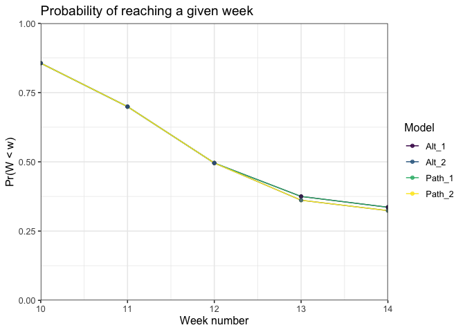

## Download data from [FiveThirtyEight](https://projects.fivethirtyeight.com/2021-nfl-predictions/games/)
I construct the week numbers, and collect the forecasted losing team, as well as 
their losing probability. 


```r
pacman::p_load(data.table, tidyverse, knitr, kableExtra, ggalt)

path <- "https://projects.fivethirtyeight.com/nfl-api/nfl_elo_latest.csv"
week1 <- as.Date("2021-09-09")

df <- fread(path)

# clean data: calculate week, get proj loser and prob of loss. 
df <- df %>%
  mutate(loser = ifelse(qbelo_prob1 > qbelo_prob2, team2, team1),
         week = floor(as.numeric(difftime(date, week1, units="days")) / 7) + 1,
         p_lose = ifelse(qbelo_prob1 > qbelo_prob2, qbelo_prob2, qbelo_prob1)) %>%
  select(week, loser, p_lose)
```

## Visualize the possible picks per week

```r
ggplot(df, aes(week, loser, fill=p_lose)) + 
    geom_tile() + scale_fill_viridis_c("Pr(Win)") + 
  theme_bw() + labs(title = "Probability of winning for underdog, week X team")
```

<!-- -->

The Texans and Lions are the most likely to lose in most weeks. We can see that 
the Texans stand out as an obvious pick in Week 2, however are more likely to lose 
in week 4.

## Identifying the optimal time to pick each team
We want to identify the optimal pick per week given the set of probabilities 
each team has of losing their weekly game subject to the constraint of only 
being able to pick each team once. 

Possible approaches: 

1.  Pick the lowest probability of winning each week
2.  Pick the lowest probability of winning each team
3.  Pick the team in a given week with the largest change if they're 
not selected.
4.  [TBD] Pick the combination of games that lead to the lowest sum of win 
probabilities across all the weeks. 

Lets compare the outcomes below, with our outcome of choice being the 
sum of the probability of winning. 

## Approach 1: 
Once a team is picked in a given week, we remove the team. We iterate through 
picking the team with the lowest probability.


```r
total_weeks <- 13

by_week <- function(teams){
  picks <- list()
  
  for(w in 1:total_weeks){
    if(w<=length(teams)){
      pick <- df %>% 
        filter(week == w) %>%
        filter(loser == teams[w])
    } else {
      pick <- df %>% 
        filter(!loser %in% teams) %>%
        filter(week == w) %>%
        arrange(p_lose) %>%
        slice(1L)
    teams <- append(teams, pick$loser)
    }
    
    picks[[w]] <- pick
      
    
  }
  picks <- do.call(rbind.data.frame, picks)
  names(picks) <- c("Week", "Team", "Pr(Win)")
  
  return(picks)
}

teams <- c()
picks <- by_week(teams)

kable(picks, digits = 2) %>%
  kable_classic(full_width = F)
```

<table class=" lightable-classic" style='font-family: "Arial Narrow", "Source Sans Pro", sans-serif; width: auto !important; margin-left: auto; margin-right: auto;'>
 <thead>
  <tr>
   <th style="text-align:right;"> Week </th>
   <th style="text-align:left;"> Team </th>
   <th style="text-align:right;"> Pr(Win) </th>
  </tr>
 </thead>
<tbody>
  <tr>
   <td style="text-align:right;"> 1 </td>
   <td style="text-align:left;"> DAL </td>
   <td style="text-align:right;"> 0.26 </td>
  </tr>
  <tr>
   <td style="text-align:right;"> 2 </td>
   <td style="text-align:left;"> HOU </td>
   <td style="text-align:right;"> 0.11 </td>
  </tr>
  <tr>
   <td style="text-align:right;"> 3 </td>
   <td style="text-align:left;"> LAC </td>
   <td style="text-align:right;"> 0.26 </td>
  </tr>
  <tr>
   <td style="text-align:right;"> 4 </td>
   <td style="text-align:left;"> PHI </td>
   <td style="text-align:right;"> 0.29 </td>
  </tr>
  <tr>
   <td style="text-align:right;"> 5 </td>
   <td style="text-align:left;"> DET </td>
   <td style="text-align:right;"> 0.24 </td>
  </tr>
  <tr>
   <td style="text-align:right;"> 6 </td>
   <td style="text-align:left;"> ARI </td>
   <td style="text-align:right;"> 0.31 </td>
  </tr>
  <tr>
   <td style="text-align:right;"> 7 </td>
   <td style="text-align:left;"> CHI </td>
   <td style="text-align:right;"> 0.20 </td>
  </tr>
  <tr>
   <td style="text-align:right;"> 8 </td>
   <td style="text-align:left;"> NYG </td>
   <td style="text-align:right;"> 0.18 </td>
  </tr>
  <tr>
   <td style="text-align:right;"> 9 </td>
   <td style="text-align:left;"> JAX </td>
   <td style="text-align:right;"> 0.26 </td>
  </tr>
  <tr>
   <td style="text-align:right;"> 10 </td>
   <td style="text-align:left;"> NYJ </td>
   <td style="text-align:right;"> 0.27 </td>
  </tr>
  <tr>
   <td style="text-align:right;"> 11 </td>
   <td style="text-align:left;"> IND </td>
   <td style="text-align:right;"> 0.28 </td>
  </tr>
  <tr>
   <td style="text-align:right;"> 12 </td>
   <td style="text-align:left;"> CAR </td>
   <td style="text-align:right;"> 0.32 </td>
  </tr>
  <tr>
   <td style="text-align:right;"> 13 </td>
   <td style="text-align:left;"> DEN </td>
   <td style="text-align:right;"> 0.22 </td>
  </tr>
</tbody>
</table>

## Approach 2: 
Pick the lowest probability for each team. 
We can iterate through picking the lowest absolute probability, then add that 
team and week and remove from the list of contenders. 

Last year the winner was determined in Week 13. We can therefore only pick the 
lowest probabilities from the first 13 weeks. This has a slight improvement 
from if we include all 18 weeks, however most of the changes are seen in later 
weeks (week 9).


```r
by_prob <- function(weeks2, teams2){
  picks2 <- list()
  w <- 1
  
  while(w <= total_weeks){
    
    if(w <= length(teams2)){
      pick <- df %>% 
        filter(week == w) %>%
        filter(loser == teams2[w])
      
    } else {
      tmp <- df
      tmp <- subset(tmp, !(loser%in%teams2))
      tmp <- subset(tmp, !(week%in%weeks2))
      tmp <- subset(tmp, week <= total_weeks)
      
      pick <- tmp %>%
        arrange(p_lose) %>%
        slice(1L)
      weeks2 <- append(weeks2, pick$week)
      teams2 <- append(teams2, pick$loser)
      
    }
    
    picks2[[w]] <- pick
    w = w+1
    
    
    
  }
  
  picks2 <- do.call(rbind.data.frame, picks2)
  picks2 <- arrange(picks2, week)
  names(picks2) <- c("Week", "Team", "Pr(Win)")
  
  return(picks2)

}
weeks2 <- c()
teams2 <- c()

picks2 <- by_prob(weeks2, teams2)

kable(picks2, digits = 2) %>%
  kable_classic(full_width = F)
```

<table class=" lightable-classic" style='font-family: "Arial Narrow", "Source Sans Pro", sans-serif; width: auto !important; margin-left: auto; margin-right: auto;'>
 <thead>
  <tr>
   <th style="text-align:right;"> Week </th>
   <th style="text-align:left;"> Team </th>
   <th style="text-align:right;"> Pr(Win) </th>
  </tr>
 </thead>
<tbody>
  <tr>
   <td style="text-align:right;"> 1 </td>
   <td style="text-align:left;"> DAL </td>
   <td style="text-align:right;"> 0.26 </td>
  </tr>
  <tr>
   <td style="text-align:right;"> 2 </td>
   <td style="text-align:left;"> DET </td>
   <td style="text-align:right;"> 0.16 </td>
  </tr>
  <tr>
   <td style="text-align:right;"> 3 </td>
   <td style="text-align:left;"> LAC </td>
   <td style="text-align:right;"> 0.26 </td>
  </tr>
  <tr>
   <td style="text-align:right;"> 4 </td>
   <td style="text-align:left;"> HOU </td>
   <td style="text-align:right;"> 0.08 </td>
  </tr>
  <tr>
   <td style="text-align:right;"> 5 </td>
   <td style="text-align:left;"> MIA </td>
   <td style="text-align:right;"> 0.26 </td>
  </tr>
  <tr>
   <td style="text-align:right;"> 6 </td>
   <td style="text-align:left;"> PHI </td>
   <td style="text-align:right;"> 0.29 </td>
  </tr>
  <tr>
   <td style="text-align:right;"> 7 </td>
   <td style="text-align:left;"> CHI </td>
   <td style="text-align:right;"> 0.20 </td>
  </tr>
  <tr>
   <td style="text-align:right;"> 8 </td>
   <td style="text-align:left;"> NYG </td>
   <td style="text-align:right;"> 0.18 </td>
  </tr>
  <tr>
   <td style="text-align:right;"> 9 </td>
   <td style="text-align:left;"> NYJ </td>
   <td style="text-align:right;"> 0.27 </td>
  </tr>
  <tr>
   <td style="text-align:right;"> 10 </td>
   <td style="text-align:left;"> OAK </td>
   <td style="text-align:right;"> 0.33 </td>
  </tr>
  <tr>
   <td style="text-align:right;"> 11 </td>
   <td style="text-align:left;"> IND </td>
   <td style="text-align:right;"> 0.28 </td>
  </tr>
  <tr>
   <td style="text-align:right;"> 12 </td>
   <td style="text-align:left;"> CAR </td>
   <td style="text-align:right;"> 0.32 </td>
  </tr>
  <tr>
   <td style="text-align:right;"> 13 </td>
   <td style="text-align:left;"> JAX </td>
   <td style="text-align:right;"> 0.19 </td>
  </tr>
</tbody>
</table>

## Approach 3: 
We can apply a different algorithm to identify the best solution. 
In words, we look to find the greatest difference between the best 
weekly pick, and the next best weekly pick. Then we pick the team 
with the largest difference, i.e. the most valuable team.
This approach is largely based on picking the teams with the largest 
opportunity cost. 

It is worth considering if this is optimal, there maybe a situation where 
the opportunity cost in one week is worth the gains across multiple weeks. 

Pseudo code:

1. Sort by lowest win probability by week
2. Calculate the difference for each week between the probabilities of the 
most likely team to lose, and the next likely. 
3. Rank the differences for the most and second most likely teams. 
4. Take the team with the largest difference. 
5. Remove this team and week from the pool. 
6. Go to the next largest difference and repeat. 


```r
opp_cost <- function(weeks, teams){
  most_constrained <- function(df, weeks, teams){
    tmp <- df %>% 
      filter(!loser %in% teams) %>%
      filter(!week %in% weeks) %>%
      group_by(week) %>%
      arrange(week, p_lose) %>% 
      mutate(diff = lead(p_lose, 1) - p_lose) %>%
      slice(1L) %>%
      ungroup() %>%
      mutate(rank = rank(-diff)) %>%
      filter(rank == 1) %>%
      select(week, loser, p_lose)
    
    return(tmp)
  }
  
  picks3 <- list()
  
  i <- 1
  while(i <= total_weeks){
    if(i<=length(teams)){
      pick <- df %>% 
        filter(week == i) %>%
        filter(loser == teams[i])
    } else {
      pick <- most_constrained(df, weeks, teams)
      teams <- append(teams, pick$loser)
      weeks <- append(weeks, pick$week)
    }
    
    picks3[[i]] <- pick
    i = i + 1 
    
  }
  
  picks3 <- do.call(rbind.data.frame, picks3)
  picks3 <- arrange(picks3, week)
  
  labs <- c("Week", "Team", "ProbWin")
  names(picks3) <- labs
    
  return(picks3)
}

teams <- c()
weeks <- c(seq(total_weeks + 1, 18, 1))
picks3 <- opp_cost(weeks, teams)
```


## Visualize differences across models

### Dumbbell plot of Approaches 1, 2, and 3

```r
labs <- c("Week", "Team", "ProbWin")
names(picks) <- labs
names(picks2) <- labs
names(picks3) <- labs

picks$Approach <- 1
picks2$Approach <- 2
picks3$Approach <- 3

data <- rbind(picks, picks2, picks3)
data$Approach <- as.factor(data$Approach)


theme_set(theme_bw(12))

ggplot(data, aes(x=Week, y=ProbWin, color = Approach, shape = Approach)) + 
  geom_line(aes(group = Week), color="#e3e2e1", size = 2) +
  geom_point(size = 3) + 
  coord_flip() + 
  scale_color_viridis_d() + 
  labs(title = "Comparing weekly win probabilities per Approach", 
       x = "Week Number", 
       y = "Probability of Win")
```

<!-- -->


### Table of by week picks
We can see that Approach 3 has a lower probability on average, with a drastically 
lower probability of winning in week 4, as with Approach 2. Something that was 
overlooked in Approach 1. 


```r
tbl <- left_join(picks, picks2, by="Week", suffix=c("_1", "_2"))
tbl <- left_join(tbl, picks3, by="Week", suffix=c("", "_3"))
tbl <- select(tbl, -c("Approach_1", "Approach_2", "Approach"))
names <- c("Week", rep(c("Team", "ProbWin"),3))
names(tbl) <- names

avg_1 <- mean(as.numeric(picks$ProbWin))
avg_2 <- mean(as.numeric(picks2$ProbWin))
avg_3 <- mean(as.numeric(picks3$ProbWin))
avg_row <- data.frame("Avg. Prob", "", avg_1, "", avg_2, "", avg_3)
names(avg_row) <- names(tbl)

tbl <- rbind(tbl, avg_row)

kbl(tbl, digits=3) %>%
  kable_classic(full_width=F) %>%
  add_header_above(c(" " = 1, "Approach 1" = 2, "Approach 2" = 2, "Approach 3" = 2)) %>%
  row_spec(total_weeks+1, bold=T)
```

<table class=" lightable-classic" style='font-family: "Arial Narrow", "Source Sans Pro", sans-serif; width: auto !important; margin-left: auto; margin-right: auto;'>
 <thead>
<tr>
<th style="empty-cells: hide;" colspan="1"></th>
<th style="padding-bottom:0; padding-left:3px;padding-right:3px;text-align: center; " colspan="2"><div style="border-bottom: 1px solid #111111; margin-bottom: -1px; ">Approach 1</div></th>
<th style="padding-bottom:0; padding-left:3px;padding-right:3px;text-align: center; " colspan="2"><div style="border-bottom: 1px solid #111111; margin-bottom: -1px; ">Approach 2</div></th>
<th style="padding-bottom:0; padding-left:3px;padding-right:3px;text-align: center; " colspan="2"><div style="border-bottom: 1px solid #111111; margin-bottom: -1px; ">Approach 3</div></th>
</tr>
  <tr>
   <th style="text-align:left;"> Week </th>
   <th style="text-align:left;"> Team </th>
   <th style="text-align:right;"> ProbWin </th>
   <th style="text-align:left;"> Team </th>
   <th style="text-align:right;"> ProbWin </th>
   <th style="text-align:left;"> Team </th>
   <th style="text-align:right;"> ProbWin </th>
  </tr>
 </thead>
<tbody>
  <tr>
   <td style="text-align:left;"> 1 </td>
   <td style="text-align:left;"> DAL </td>
   <td style="text-align:right;"> 0.264 </td>
   <td style="text-align:left;"> DAL </td>
   <td style="text-align:right;"> 0.264 </td>
   <td style="text-align:left;"> DAL </td>
   <td style="text-align:right;"> 0.264 </td>
  </tr>
  <tr>
   <td style="text-align:left;"> 2 </td>
   <td style="text-align:left;"> HOU </td>
   <td style="text-align:right;"> 0.106 </td>
   <td style="text-align:left;"> DET </td>
   <td style="text-align:right;"> 0.159 </td>
   <td style="text-align:left;"> DET </td>
   <td style="text-align:right;"> 0.159 </td>
  </tr>
  <tr>
   <td style="text-align:left;"> 3 </td>
   <td style="text-align:left;"> LAC </td>
   <td style="text-align:right;"> 0.262 </td>
   <td style="text-align:left;"> LAC </td>
   <td style="text-align:right;"> 0.262 </td>
   <td style="text-align:left;"> LAC </td>
   <td style="text-align:right;"> 0.262 </td>
  </tr>
  <tr>
   <td style="text-align:left;"> 4 </td>
   <td style="text-align:left;"> PHI </td>
   <td style="text-align:right;"> 0.286 </td>
   <td style="text-align:left;"> HOU </td>
   <td style="text-align:right;"> 0.081 </td>
   <td style="text-align:left;"> HOU </td>
   <td style="text-align:right;"> 0.081 </td>
  </tr>
  <tr>
   <td style="text-align:left;"> 5 </td>
   <td style="text-align:left;"> DET </td>
   <td style="text-align:right;"> 0.240 </td>
   <td style="text-align:left;"> MIA </td>
   <td style="text-align:right;"> 0.259 </td>
   <td style="text-align:left;"> MIA </td>
   <td style="text-align:right;"> 0.259 </td>
  </tr>
  <tr>
   <td style="text-align:left;"> 6 </td>
   <td style="text-align:left;"> ARI </td>
   <td style="text-align:right;"> 0.309 </td>
   <td style="text-align:left;"> PHI </td>
   <td style="text-align:right;"> 0.285 </td>
   <td style="text-align:left;"> PHI </td>
   <td style="text-align:right;"> 0.285 </td>
  </tr>
  <tr>
   <td style="text-align:left;"> 7 </td>
   <td style="text-align:left;"> CHI </td>
   <td style="text-align:right;"> 0.195 </td>
   <td style="text-align:left;"> CHI </td>
   <td style="text-align:right;"> 0.195 </td>
   <td style="text-align:left;"> CHI </td>
   <td style="text-align:right;"> 0.195 </td>
  </tr>
  <tr>
   <td style="text-align:left;"> 8 </td>
   <td style="text-align:left;"> NYG </td>
   <td style="text-align:right;"> 0.184 </td>
   <td style="text-align:left;"> NYG </td>
   <td style="text-align:right;"> 0.184 </td>
   <td style="text-align:left;"> JAX </td>
   <td style="text-align:right;"> 0.226 </td>
  </tr>
  <tr>
   <td style="text-align:left;"> 9 </td>
   <td style="text-align:left;"> JAX </td>
   <td style="text-align:right;"> 0.263 </td>
   <td style="text-align:left;"> NYJ </td>
   <td style="text-align:right;"> 0.270 </td>
   <td style="text-align:left;"> MIN </td>
   <td style="text-align:right;"> 0.278 </td>
  </tr>
  <tr>
   <td style="text-align:left;"> 10 </td>
   <td style="text-align:left;"> NYJ </td>
   <td style="text-align:right;"> 0.273 </td>
   <td style="text-align:left;"> OAK </td>
   <td style="text-align:right;"> 0.327 </td>
   <td style="text-align:left;"> NYJ </td>
   <td style="text-align:right;"> 0.273 </td>
  </tr>
  <tr>
   <td style="text-align:left;"> 11 </td>
   <td style="text-align:left;"> IND </td>
   <td style="text-align:right;"> 0.276 </td>
   <td style="text-align:left;"> IND </td>
   <td style="text-align:right;"> 0.276 </td>
   <td style="text-align:left;"> NYG </td>
   <td style="text-align:right;"> 0.206 </td>
  </tr>
  <tr>
   <td style="text-align:left;"> 12 </td>
   <td style="text-align:left;"> CAR </td>
   <td style="text-align:right;"> 0.317 </td>
   <td style="text-align:left;"> CAR </td>
   <td style="text-align:right;"> 0.317 </td>
   <td style="text-align:left;"> CAR </td>
   <td style="text-align:right;"> 0.317 </td>
  </tr>
  <tr>
   <td style="text-align:left;"> 13 </td>
   <td style="text-align:left;"> DEN </td>
   <td style="text-align:right;"> 0.220 </td>
   <td style="text-align:left;"> JAX </td>
   <td style="text-align:right;"> 0.187 </td>
   <td style="text-align:left;"> DEN </td>
   <td style="text-align:right;"> 0.220 </td>
  </tr>
  <tr>
   <td style="text-align:left;font-weight: bold;"> Avg. Prob </td>
   <td style="text-align:left;font-weight: bold;">  </td>
   <td style="text-align:right;font-weight: bold;"> 0.246 </td>
   <td style="text-align:left;font-weight: bold;">  </td>
   <td style="text-align:right;font-weight: bold;"> 0.236 </td>
   <td style="text-align:left;font-weight: bold;">  </td>
   <td style="text-align:right;font-weight: bold;"> 0.233 </td>
  </tr>
</tbody>
</table>

## Deviations in the first round
Pittsburgh is not picked up in any of the models, yet they are only 2% behind 
Dallas in Week 1. Below we look at the same three approaches but with Pittsburgh 
selected in Week 1. 

Comparing the results, we see the average performance is 0.01 higher when we 
force PIT in round 1. For this reason, it does not make sense to make a sole 
pick using PIT, however, it can be worth hedging a bet selecting them in the 
first round when multiple picks are submitted.


```r
teams <- c("PIT")
weeks <- c(1, seq(total_weeks + 1, 18, 1))

picks <- by_week(teams)
picks2 <- by_prob(weeks, teams)
picks3 <- opp_cost(weeks, teams)

tbl <- left_join(picks, picks2, by="Week", suffix=c("_1", "_2"))
tbl <- left_join(tbl, picks3, by="Week", suffix=c("", "_3"))
names <- c("Week", rep(c("Team", "ProbWin"),3))
names(tbl) <- names

avg_1 <- mean(as.numeric(picks$`Pr(Win)`))
avg_2 <- mean(as.numeric(picks2$`Pr(Win)`))
avg_3 <- mean(as.numeric(picks3$ProbWin))
avg_row <- data.frame("Avg. Prob", "", avg_1, "", avg_2, "", avg_3)
names(avg_row) <- names(tbl)

tbl <- rbind(tbl, avg_row)

kbl(tbl, digits=3) %>%
  kable_classic(full_width=F) %>%
  add_header_above(c(" " = 1, "Approach 1" = 2, "Approach 2" = 2, "Approach 3" = 2)) %>%
  row_spec(total_weeks+1, bold=T)
```

<table class=" lightable-classic" style='font-family: "Arial Narrow", "Source Sans Pro", sans-serif; width: auto !important; margin-left: auto; margin-right: auto;'>
 <thead>
<tr>
<th style="empty-cells: hide;" colspan="1"></th>
<th style="padding-bottom:0; padding-left:3px;padding-right:3px;text-align: center; " colspan="2"><div style="border-bottom: 1px solid #111111; margin-bottom: -1px; ">Approach 1</div></th>
<th style="padding-bottom:0; padding-left:3px;padding-right:3px;text-align: center; " colspan="2"><div style="border-bottom: 1px solid #111111; margin-bottom: -1px; ">Approach 2</div></th>
<th style="padding-bottom:0; padding-left:3px;padding-right:3px;text-align: center; " colspan="2"><div style="border-bottom: 1px solid #111111; margin-bottom: -1px; ">Approach 3</div></th>
</tr>
  <tr>
   <th style="text-align:left;"> Week </th>
   <th style="text-align:left;"> Team </th>
   <th style="text-align:right;"> ProbWin </th>
   <th style="text-align:left;"> Team </th>
   <th style="text-align:right;"> ProbWin </th>
   <th style="text-align:left;"> Team </th>
   <th style="text-align:right;"> ProbWin </th>
  </tr>
 </thead>
<tbody>
  <tr>
   <td style="text-align:left;"> 1 </td>
   <td style="text-align:left;"> PIT </td>
   <td style="text-align:right;"> 0.283 </td>
   <td style="text-align:left;"> PIT </td>
   <td style="text-align:right;"> 0.283 </td>
   <td style="text-align:left;"> PIT </td>
   <td style="text-align:right;"> 0.283 </td>
  </tr>
  <tr>
   <td style="text-align:left;"> 2 </td>
   <td style="text-align:left;"> HOU </td>
   <td style="text-align:right;"> 0.106 </td>
   <td style="text-align:left;"> DET </td>
   <td style="text-align:right;"> 0.159 </td>
   <td style="text-align:left;"> DET </td>
   <td style="text-align:right;"> 0.159 </td>
  </tr>
  <tr>
   <td style="text-align:left;"> 3 </td>
   <td style="text-align:left;"> LAC </td>
   <td style="text-align:right;"> 0.262 </td>
   <td style="text-align:left;"> LAC </td>
   <td style="text-align:right;"> 0.262 </td>
   <td style="text-align:left;"> LAC </td>
   <td style="text-align:right;"> 0.262 </td>
  </tr>
  <tr>
   <td style="text-align:left;"> 4 </td>
   <td style="text-align:left;"> PHI </td>
   <td style="text-align:right;"> 0.286 </td>
   <td style="text-align:left;"> HOU </td>
   <td style="text-align:right;"> 0.081 </td>
   <td style="text-align:left;"> HOU </td>
   <td style="text-align:right;"> 0.081 </td>
  </tr>
  <tr>
   <td style="text-align:left;"> 5 </td>
   <td style="text-align:left;"> DET </td>
   <td style="text-align:right;"> 0.240 </td>
   <td style="text-align:left;"> MIA </td>
   <td style="text-align:right;"> 0.259 </td>
   <td style="text-align:left;"> MIA </td>
   <td style="text-align:right;"> 0.259 </td>
  </tr>
  <tr>
   <td style="text-align:left;"> 6 </td>
   <td style="text-align:left;"> ARI </td>
   <td style="text-align:right;"> 0.309 </td>
   <td style="text-align:left;"> PHI </td>
   <td style="text-align:right;"> 0.285 </td>
   <td style="text-align:left;"> PHI </td>
   <td style="text-align:right;"> 0.285 </td>
  </tr>
  <tr>
   <td style="text-align:left;"> 7 </td>
   <td style="text-align:left;"> CHI </td>
   <td style="text-align:right;"> 0.195 </td>
   <td style="text-align:left;"> CHI </td>
   <td style="text-align:right;"> 0.195 </td>
   <td style="text-align:left;"> CHI </td>
   <td style="text-align:right;"> 0.195 </td>
  </tr>
  <tr>
   <td style="text-align:left;"> 8 </td>
   <td style="text-align:left;"> NYG </td>
   <td style="text-align:right;"> 0.184 </td>
   <td style="text-align:left;"> NYG </td>
   <td style="text-align:right;"> 0.184 </td>
   <td style="text-align:left;"> JAX </td>
   <td style="text-align:right;"> 0.226 </td>
  </tr>
  <tr>
   <td style="text-align:left;"> 9 </td>
   <td style="text-align:left;"> JAX </td>
   <td style="text-align:right;"> 0.263 </td>
   <td style="text-align:left;"> NYJ </td>
   <td style="text-align:right;"> 0.270 </td>
   <td style="text-align:left;"> MIN </td>
   <td style="text-align:right;"> 0.278 </td>
  </tr>
  <tr>
   <td style="text-align:left;"> 10 </td>
   <td style="text-align:left;"> NYJ </td>
   <td style="text-align:right;"> 0.273 </td>
   <td style="text-align:left;"> OAK </td>
   <td style="text-align:right;"> 0.327 </td>
   <td style="text-align:left;"> NYJ </td>
   <td style="text-align:right;"> 0.273 </td>
  </tr>
  <tr>
   <td style="text-align:left;"> 11 </td>
   <td style="text-align:left;"> DAL </td>
   <td style="text-align:right;"> 0.267 </td>
   <td style="text-align:left;"> DAL </td>
   <td style="text-align:right;"> 0.267 </td>
   <td style="text-align:left;"> NYG </td>
   <td style="text-align:right;"> 0.206 </td>
  </tr>
  <tr>
   <td style="text-align:left;"> 12 </td>
   <td style="text-align:left;"> CAR </td>
   <td style="text-align:right;"> 0.317 </td>
   <td style="text-align:left;"> CAR </td>
   <td style="text-align:right;"> 0.317 </td>
   <td style="text-align:left;"> CAR </td>
   <td style="text-align:right;"> 0.317 </td>
  </tr>
  <tr>
   <td style="text-align:left;"> 13 </td>
   <td style="text-align:left;"> DEN </td>
   <td style="text-align:right;"> 0.220 </td>
   <td style="text-align:left;"> JAX </td>
   <td style="text-align:right;"> 0.187 </td>
   <td style="text-align:left;"> DEN </td>
   <td style="text-align:right;"> 0.220 </td>
  </tr>
  <tr>
   <td style="text-align:left;font-weight: bold;"> Avg. Prob </td>
   <td style="text-align:left;font-weight: bold;">  </td>
   <td style="text-align:right;font-weight: bold;"> 0.247 </td>
   <td style="text-align:left;font-weight: bold;">  </td>
   <td style="text-align:right;font-weight: bold;"> 0.237 </td>
   <td style="text-align:left;font-weight: bold;">  </td>
   <td style="text-align:right;font-weight: bold;"> 0.234 </td>
  </tr>
</tbody>
</table>


# In developent.. 
Need to come up with the way of solving the below equation.

## Approach 4: 
This is a linear optimization problem. Normally I could solve this quickly in 
Excel using the built in solver. 

Our optimization problem is the following 
$$ \min_{x_{it}} \sum_i\sum_t p_{it}x_{it} \text{ s.t.} $$
$$\text{Team constraint: } \sum_i x_i \leq 1 \\ \text{Week constraint: }x_t = 1 \forall t $$

## Other considerations:   


### Optimal picks weeks 3 onward. 
1. There is a rebuy after weeks 1 and 2. I can begin my algorithms in week 3 
and onward, and then take the remaining picks in weeks 1 & 2, given the crutch of 
a rebuy. 


```r
teams <- c("", "")
weeks <- c(1, 2, seq(total_weeks + 1, 18, 1))

picks <- by_week(teams)
picks2 <- by_prob(weeks, teams)
picks3 <- opp_cost(weeks, teams)

tbl <- left_join(picks, picks2, by="Week", suffix=c("_1", "_2"))
tbl <- left_join(tbl, picks3, by="Week", suffix=c("", "_3"))
names <- c("Week", rep(c("Team", "ProbWin"),3))
names(tbl) <- names

avg_1 <- mean(as.numeric(picks$`Pr(Win)`))
avg_2 <- mean(as.numeric(picks2$`Pr(Win)`))
avg_3 <- mean(as.numeric(picks3$ProbWin))
avg_row <- data.frame("Avg. Prob", "", avg_1, "", avg_2, "", avg_3)
names(avg_row) <- names(tbl)

tbl <- rbind(tbl, avg_row)

kbl(tbl, digits=3) %>%
  kable_classic(full_width=F) %>%
  add_header_above(c(" " = 1, "Approach 1" = 2, "Approach 2" = 2, "Approach 3" = 2)) %>%
  row_spec(total_weeks-1, bold=T)
```

<table class=" lightable-classic" style='font-family: "Arial Narrow", "Source Sans Pro", sans-serif; width: auto !important; margin-left: auto; margin-right: auto;'>
 <thead>
<tr>
<th style="empty-cells: hide;" colspan="1"></th>
<th style="padding-bottom:0; padding-left:3px;padding-right:3px;text-align: center; " colspan="2"><div style="border-bottom: 1px solid #111111; margin-bottom: -1px; ">Approach 1</div></th>
<th style="padding-bottom:0; padding-left:3px;padding-right:3px;text-align: center; " colspan="2"><div style="border-bottom: 1px solid #111111; margin-bottom: -1px; ">Approach 2</div></th>
<th style="padding-bottom:0; padding-left:3px;padding-right:3px;text-align: center; " colspan="2"><div style="border-bottom: 1px solid #111111; margin-bottom: -1px; ">Approach 3</div></th>
</tr>
  <tr>
   <th style="text-align:left;"> Week </th>
   <th style="text-align:left;"> Team </th>
   <th style="text-align:right;"> ProbWin </th>
   <th style="text-align:left;"> Team </th>
   <th style="text-align:right;"> ProbWin </th>
   <th style="text-align:left;"> Team </th>
   <th style="text-align:right;"> ProbWin </th>
  </tr>
 </thead>
<tbody>
  <tr>
   <td style="text-align:left;"> 3 </td>
   <td style="text-align:left;"> LAC </td>
   <td style="text-align:right;"> 0.262 </td>
   <td style="text-align:left;"> LAC </td>
   <td style="text-align:right;"> 0.262 </td>
   <td style="text-align:left;"> LAC </td>
   <td style="text-align:right;"> 0.262 </td>
  </tr>
  <tr>
   <td style="text-align:left;"> 4 </td>
   <td style="text-align:left;"> HOU </td>
   <td style="text-align:right;"> 0.081 </td>
   <td style="text-align:left;"> HOU </td>
   <td style="text-align:right;"> 0.081 </td>
   <td style="text-align:left;"> HOU </td>
   <td style="text-align:right;"> 0.081 </td>
  </tr>
  <tr>
   <td style="text-align:left;"> 5 </td>
   <td style="text-align:left;"> DET </td>
   <td style="text-align:right;"> 0.240 </td>
   <td style="text-align:left;"> MIA </td>
   <td style="text-align:right;"> 0.259 </td>
   <td style="text-align:left;"> MIA </td>
   <td style="text-align:right;"> 0.259 </td>
  </tr>
  <tr>
   <td style="text-align:left;"> 6 </td>
   <td style="text-align:left;"> PHI </td>
   <td style="text-align:right;"> 0.285 </td>
   <td style="text-align:left;"> PHI </td>
   <td style="text-align:right;"> 0.285 </td>
   <td style="text-align:left;"> PHI </td>
   <td style="text-align:right;"> 0.285 </td>
  </tr>
  <tr>
   <td style="text-align:left;"> 7 </td>
   <td style="text-align:left;"> CHI </td>
   <td style="text-align:right;"> 0.195 </td>
   <td style="text-align:left;"> DET </td>
   <td style="text-align:right;"> 0.178 </td>
   <td style="text-align:left;"> CHI </td>
   <td style="text-align:right;"> 0.195 </td>
  </tr>
  <tr>
   <td style="text-align:left;"> 8 </td>
   <td style="text-align:left;"> NYG </td>
   <td style="text-align:right;"> 0.184 </td>
   <td style="text-align:left;"> NYG </td>
   <td style="text-align:right;"> 0.184 </td>
   <td style="text-align:left;"> NYG </td>
   <td style="text-align:right;"> 0.184 </td>
  </tr>
  <tr>
   <td style="text-align:left;"> 9 </td>
   <td style="text-align:left;"> JAX </td>
   <td style="text-align:right;"> 0.263 </td>
   <td style="text-align:left;"> NYJ </td>
   <td style="text-align:right;"> 0.270 </td>
   <td style="text-align:left;"> MIN </td>
   <td style="text-align:right;"> 0.278 </td>
  </tr>
  <tr>
   <td style="text-align:left;"> 10 </td>
   <td style="text-align:left;"> NYJ </td>
   <td style="text-align:right;"> 0.273 </td>
   <td style="text-align:left;"> OAK </td>
   <td style="text-align:right;"> 0.327 </td>
   <td style="text-align:left;"> NYJ </td>
   <td style="text-align:right;"> 0.273 </td>
  </tr>
  <tr>
   <td style="text-align:left;"> 11 </td>
   <td style="text-align:left;"> DAL </td>
   <td style="text-align:right;"> 0.267 </td>
   <td style="text-align:left;"> DAL </td>
   <td style="text-align:right;"> 0.267 </td>
   <td style="text-align:left;"> DET </td>
   <td style="text-align:right;"> 0.188 </td>
  </tr>
  <tr>
   <td style="text-align:left;"> 12 </td>
   <td style="text-align:left;"> CAR </td>
   <td style="text-align:right;"> 0.317 </td>
   <td style="text-align:left;"> CAR </td>
   <td style="text-align:right;"> 0.317 </td>
   <td style="text-align:left;"> CAR </td>
   <td style="text-align:right;"> 0.317 </td>
  </tr>
  <tr>
   <td style="text-align:left;"> 13 </td>
   <td style="text-align:left;"> DEN </td>
   <td style="text-align:right;"> 0.220 </td>
   <td style="text-align:left;"> JAX </td>
   <td style="text-align:right;"> 0.187 </td>
   <td style="text-align:left;"> JAX </td>
   <td style="text-align:right;"> 0.187 </td>
  </tr>
  <tr>
   <td style="text-align:left;font-weight: bold;"> Avg. Prob </td>
   <td style="text-align:left;font-weight: bold;">  </td>
   <td style="text-align:right;font-weight: bold;"> 0.235 </td>
   <td style="text-align:left;font-weight: bold;">  </td>
   <td style="text-align:right;font-weight: bold;"> 0.238 </td>
   <td style="text-align:left;font-weight: bold;">  </td>
   <td style="text-align:right;font-weight: bold;"> 0.228 </td>
  </tr>
</tbody>
</table>

Missing from the respective lists are: 

1. PIT and ATL
2. CHI and ATL
3. DAL and ATL  
Our updated averages become: 0.236, 0.237, and 0.230. 

Surprisingly a weak improvement in each approach! Note: the analysis was done 
ad-hoc in an excel sheet. I didn't feel like coding this one up to check which 
teams are missing from each week and what the best picks otherwise are. 
