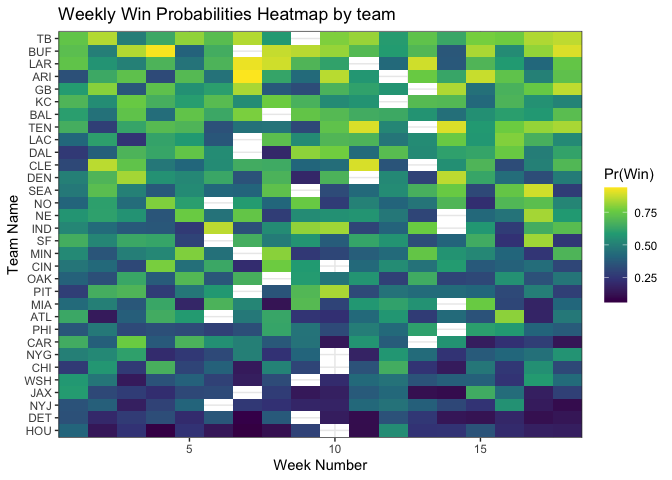

## Download data from [FiveThirtyEight](https://projects.fivethirtyeight.com/2021-nfl-predictions/games/)
I construct the week numbers, and collect the forecasted losing team, as well as 
their losing probability. 


```r
pacman::p_load(data.table, tidyverse, knitr, kableExtra, ggalt)

path <- "https://projects.fivethirtyeight.com/nfl-api/nfl_elo_latest.csv"
week1 <- as.Date("2021-09-09")

df <- fread(path)

# clean data: calculate week, get proj loser and prob of loss. 
df <- df %>%
  mutate(loser = ifelse(qbelo_prob1 > qbelo_prob2, team2, team1),
         week = floor(as.numeric(difftime(date, week1, units="days")) / 7) + 1,
         p_lose = ifelse(qbelo_prob1 > qbelo_prob2, qbelo_prob2, qbelo_prob1)) %>%
  select(week, loser, p_lose)
```

## Visualize the possible picks per week

```r
ggplot(df, aes(week, loser, fill=p_lose)) + 
    geom_tile() + scale_fill_viridis_c("Pr(Win)") + 
  theme_bw() + labs(title = "Probability of winning for underdog, week X team")
```

<!-- -->

The Texans and Lions are the most likely to lose in most weeks. We can see that 
the Texans stand out as an obvious pick in Week 2, however are more likely to lose 
in week 4.

## Identifying the optimal time to pick each team
We want to identify the optimal pick per week given the set of probabilities 
each team has of losing their weekly game subject to the constraint of only 
being able to pick each team once. 

Possible approaches: 

1.  Pick the lowest probability of winning each week
2.  Pick the lowest probability of winning each team
3.  Pick the combination of games that lead to the lowest sum of win 
probabilities across all the weeks. 
4.  Same as above with discounting: i.e. future weeks cost more.

Lets compare the outcomes below, with our outcome of choice being the 
sum of the probability of winning. 

## Approach 1: 
Once a team is picked in a given week, we remove the team. We iterate through 
picking the team with the lowest probability.


```r
picks <- list()
teams <- c()

for(w in 1:18){
  
    if(w>1){
      tmp <- subset(df, !(loser%in%teams))
    } else{tmp <- df}
  
    pick <- tmp %>% filter(week == w) %>%
      arrange(p_lose) %>%
      slice(1L)
  teams <- append(teams, pick$loser)
  picks[[w]] <- pick
  
}

picks <- do.call(rbind.data.frame, picks)
names(picks) <- c("Week", "Team", "Pr(Win)")

kable(picks, digits = 2) %>%
  kable_classic(full_width = F)
```

<table class=" lightable-classic" style='font-family: "Arial Narrow", "Source Sans Pro", sans-serif; width: auto !important; margin-left: auto; margin-right: auto;'>
 <thead>
  <tr>
   <th style="text-align:right;"> Week </th>
   <th style="text-align:left;"> Team </th>
   <th style="text-align:right;"> Pr(Win) </th>
  </tr>
 </thead>
<tbody>
  <tr>
   <td style="text-align:right;"> 1 </td>
   <td style="text-align:left;"> DAL </td>
   <td style="text-align:right;"> 0.26 </td>
  </tr>
  <tr>
   <td style="text-align:right;"> 2 </td>
   <td style="text-align:left;"> HOU </td>
   <td style="text-align:right;"> 0.11 </td>
  </tr>
  <tr>
   <td style="text-align:right;"> 3 </td>
   <td style="text-align:left;"> LAC </td>
   <td style="text-align:right;"> 0.26 </td>
  </tr>
  <tr>
   <td style="text-align:right;"> 4 </td>
   <td style="text-align:left;"> PHI </td>
   <td style="text-align:right;"> 0.29 </td>
  </tr>
  <tr>
   <td style="text-align:right;"> 5 </td>
   <td style="text-align:left;"> DET </td>
   <td style="text-align:right;"> 0.24 </td>
  </tr>
  <tr>
   <td style="text-align:right;"> 6 </td>
   <td style="text-align:left;"> ARI </td>
   <td style="text-align:right;"> 0.31 </td>
  </tr>
  <tr>
   <td style="text-align:right;"> 7 </td>
   <td style="text-align:left;"> CHI </td>
   <td style="text-align:right;"> 0.20 </td>
  </tr>
  <tr>
   <td style="text-align:right;"> 8 </td>
   <td style="text-align:left;"> NYG </td>
   <td style="text-align:right;"> 0.18 </td>
  </tr>
  <tr>
   <td style="text-align:right;"> 9 </td>
   <td style="text-align:left;"> JAX </td>
   <td style="text-align:right;"> 0.26 </td>
  </tr>
  <tr>
   <td style="text-align:right;"> 10 </td>
   <td style="text-align:left;"> NYJ </td>
   <td style="text-align:right;"> 0.27 </td>
  </tr>
  <tr>
   <td style="text-align:right;"> 11 </td>
   <td style="text-align:left;"> IND </td>
   <td style="text-align:right;"> 0.28 </td>
  </tr>
  <tr>
   <td style="text-align:right;"> 12 </td>
   <td style="text-align:left;"> CAR </td>
   <td style="text-align:right;"> 0.32 </td>
  </tr>
  <tr>
   <td style="text-align:right;"> 13 </td>
   <td style="text-align:left;"> DEN </td>
   <td style="text-align:right;"> 0.22 </td>
  </tr>
  <tr>
   <td style="text-align:right;"> 14 </td>
   <td style="text-align:left;"> OAK </td>
   <td style="text-align:right;"> 0.20 </td>
  </tr>
  <tr>
   <td style="text-align:right;"> 15 </td>
   <td style="text-align:left;"> NO </td>
   <td style="text-align:right;"> 0.28 </td>
  </tr>
  <tr>
   <td style="text-align:right;"> 16 </td>
   <td style="text-align:left;"> PIT </td>
   <td style="text-align:right;"> 0.25 </td>
  </tr>
  <tr>
   <td style="text-align:right;"> 17 </td>
   <td style="text-align:left;"> ATL </td>
   <td style="text-align:right;"> 0.23 </td>
  </tr>
  <tr>
   <td style="text-align:right;"> 18 </td>
   <td style="text-align:left;"> CIN </td>
   <td style="text-align:right;"> 0.25 </td>
  </tr>
</tbody>
</table>

```r
app1_prob <- sum(picks$ProbWin)
```

## Approach 2: 
Pick the lowest probability for each team. 
We can iterate through picking the lowest absolute probability, then add that 
team and week and remove from the list of contenders. 


```r
weeks2 <- c()
teams2 <- c()
picks2 <- list()
w <- 1
while(w <= 18){
  tmp <- df
  tmp <- subset(tmp, !(loser%in%teams2))
  tmp <- subset(tmp, !(week%in%weeks2))
  
  pick <- tmp %>%
    arrange(p_lose) %>%
    slice(1L)
  weeks2 <- append(weeks2, pick$week)
  teams2 <- append(teams2, pick$loser)
  picks2[[w]] <- pick
  
  w = w+1
}

picks2 <- do.call(rbind.data.frame, picks2)
picks2 <- arrange(picks2, week)
names(picks2) <- c("Week", "Team", "Pr(Win)")

kable(picks2, digits = 2) %>%
  kable_classic(full_width = F)
```

<table class=" lightable-classic" style='font-family: "Arial Narrow", "Source Sans Pro", sans-serif; width: auto !important; margin-left: auto; margin-right: auto;'>
 <thead>
  <tr>
   <th style="text-align:right;"> Week </th>
   <th style="text-align:left;"> Team </th>
   <th style="text-align:right;"> Pr(Win) </th>
  </tr>
 </thead>
<tbody>
  <tr>
   <td style="text-align:right;"> 1 </td>
   <td style="text-align:left;"> DAL </td>
   <td style="text-align:right;"> 0.26 </td>
  </tr>
  <tr>
   <td style="text-align:right;"> 2 </td>
   <td style="text-align:left;"> DET </td>
   <td style="text-align:right;"> 0.16 </td>
  </tr>
  <tr>
   <td style="text-align:right;"> 3 </td>
   <td style="text-align:left;"> LAC </td>
   <td style="text-align:right;"> 0.26 </td>
  </tr>
  <tr>
   <td style="text-align:right;"> 4 </td>
   <td style="text-align:left;"> HOU </td>
   <td style="text-align:right;"> 0.08 </td>
  </tr>
  <tr>
   <td style="text-align:right;"> 5 </td>
   <td style="text-align:left;"> MIA </td>
   <td style="text-align:right;"> 0.26 </td>
  </tr>
  <tr>
   <td style="text-align:right;"> 6 </td>
   <td style="text-align:left;"> PHI </td>
   <td style="text-align:right;"> 0.29 </td>
  </tr>
  <tr>
   <td style="text-align:right;"> 7 </td>
   <td style="text-align:left;"> CHI </td>
   <td style="text-align:right;"> 0.20 </td>
  </tr>
  <tr>
   <td style="text-align:right;"> 8 </td>
   <td style="text-align:left;"> NYG </td>
   <td style="text-align:right;"> 0.18 </td>
  </tr>
  <tr>
   <td style="text-align:right;"> 9 </td>
   <td style="text-align:left;"> MIN </td>
   <td style="text-align:right;"> 0.28 </td>
  </tr>
  <tr>
   <td style="text-align:right;"> 10 </td>
   <td style="text-align:left;"> SEA </td>
   <td style="text-align:right;"> 0.38 </td>
  </tr>
  <tr>
   <td style="text-align:right;"> 11 </td>
   <td style="text-align:left;"> IND </td>
   <td style="text-align:right;"> 0.28 </td>
  </tr>
  <tr>
   <td style="text-align:right;"> 12 </td>
   <td style="text-align:left;"> CLE </td>
   <td style="text-align:right;"> 0.38 </td>
  </tr>
  <tr>
   <td style="text-align:right;"> 13 </td>
   <td style="text-align:left;"> JAX </td>
   <td style="text-align:right;"> 0.19 </td>
  </tr>
  <tr>
   <td style="text-align:right;"> 14 </td>
   <td style="text-align:left;"> OAK </td>
   <td style="text-align:right;"> 0.20 </td>
  </tr>
  <tr>
   <td style="text-align:right;"> 15 </td>
   <td style="text-align:left;"> CAR </td>
   <td style="text-align:right;"> 0.21 </td>
  </tr>
  <tr>
   <td style="text-align:right;"> 16 </td>
   <td style="text-align:left;"> PIT </td>
   <td style="text-align:right;"> 0.25 </td>
  </tr>
  <tr>
   <td style="text-align:right;"> 17 </td>
   <td style="text-align:left;"> ATL </td>
   <td style="text-align:right;"> 0.23 </td>
  </tr>
  <tr>
   <td style="text-align:right;"> 18 </td>
   <td style="text-align:left;"> NYJ </td>
   <td style="text-align:right;"> 0.16 </td>
  </tr>
</tbody>
</table>

```r
app2_prob <- sum(picks2$ProbWin)
```

## Approach 3: 
This is a linear optimization problem. Normally I could solve this quickly in 
Excel using the built in solver. 


Our optimization problem is the following 
$$ \min_{x_{it}} \sum_i\sum_t p_{it}x_{it} \text{ s.t.} $$
$$\text{Team constraint: } \sum_i x_i \leq 1 \\ \text{Week constraint: }x_t = 1 \forall t $$


```r
labs <- c("Week", "Team", "ProbWin")
names(picks) <- labs
names(picks2) <- labs

picks$Type <- 1
picks2$Type <- 2

data <- rbind(picks, picks2)

data <- left_join(picks, picks2, by="Week", suffix=c("_1","_2"))

ggplot(data, aes(y=Week, x=ProbWin_1, xend=ProbWin_2)) +
  geom_dumbbell(size=3, color="#e3e2e1",
                colour_x = "#298fca", colour_xend = "#094c72",
                dot_guide=FALSE, dot_guide_size=0.25) + 
  labs(title="Comparing Approach 1 and Approach 2 on Weekly Risk", x="Probability of Win") +
  theme_bw() +
  theme(panel.grid.major.x=element_line(size=0.05))
```

<!-- -->


Both approaches have the same pick in week 1, but a large difference in picks 
for Week 3. This analysis is still in progress. 
